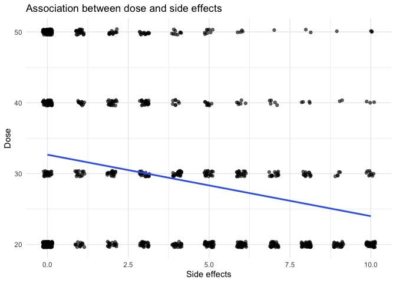
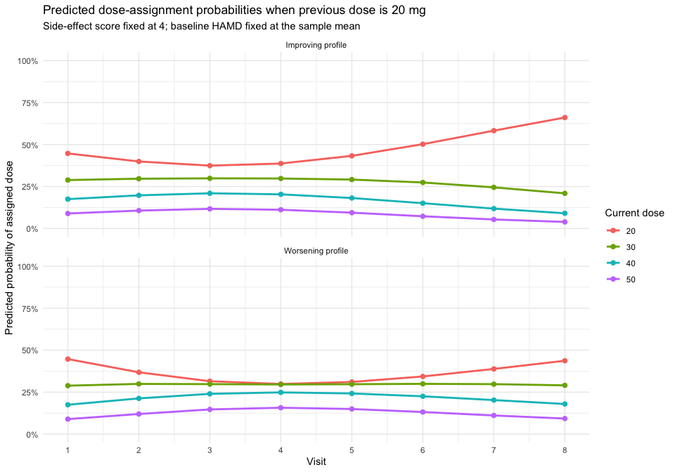
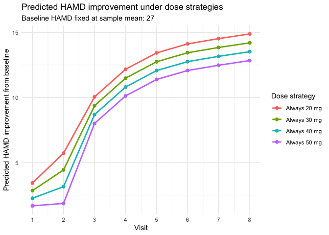

Flexible dose-response models
================

- [Clinical outcome, safety measure, time-varying confounders, and
  dataset](#clinical-outcome-safety-measure-time-varying-confounders-and-dataset)
- [Notation](#notation)
- [Step 1 - Inverse probability of dose and censoring weighting
  (IPDCW)](#step-1---inverse-probability-of-dose-and-censoring-weighting-ipdcw)
  - [Inverse probability of dose weights
    (IPTW)](#inverse-probability-of-dose-weights-iptw)
  - [Inverse probability of censoring weights
    (IPCW)](#inverse-probability-of-censoring-weights-ipcw)
  - [Total stabilized weights and
    truncation](#total-stabilized-weights-and-truncation)
- [Step 2 - Weighted repeated-measures marginal structural model
  MSM](#step-2---weighted-repeated-measures-marginal-structural-model-msm)
- [Predictions](#predictions)
- [References](#references)
- [Appendix](#appendix)
  - [Predicted probabilities under the ordinal dose
    model](#predicted-probabilities-under-the-ordinal-dose-model)
  - [Alternative multinomial dose model for stabilized dose
    weights](#alternative-multinomial-dose-model-for-stabilized-dose-weights)

<style type="text/css">
#TOC {
  margin: 25px 0px 20px 0px;
}
&#10;div.tocify {
  width: 40%;
  max-width: 450px;
}
</style>

## Clinical outcome, safety measure, time-varying confounders, and dataset

The clinical outcome of the included study is the Hamilton Depression
Rating Scale (HAMD) score, denoted by $Y_{it}$, measured for patient $i$
at visit $t$. The baseline HAMD score was denoted by $Y_{i0}$. Treatment
response was expressed as improvement from baseline: $$
\Delta Y_{it} = Y_{i0} - Y_{it}
$$ Thus, positive values of $ΔY_{it}$ indicate improvement. Safety was
summarized at each visit using a side-effect score $S_{it}$, measured on
a 0–10 scale, where higher values indicate a greater number of side
effects reported by the patient.

In this setting, we distinguished between previous dose history and
time-varying confounder history. Previous dose $d_{it-1}$ was treated as
part of the treatment process, because it defines the dose trajectory
and is a strong predictor of the next assigned dose. <u>Time-varying
confounders</u> were defined as post-baseline clinical variables, other
than dose itself, that may be affected by previous dose and may also
influence subsequent dose assignment, future outcomes, or
discontinuation. Specifically, efficacy (HAMD improvement) $ΔY_{it}$,
and side-effect severity $S_{it}$ were treated as time-varying
confounders.

The dataset includes 170 patients treated with Paroxetine and 996
patient-visits in total. The observed dose levels were 20, 30, 40, 50.
Summary statistics for efficacy and side-effects are shown below.

|                  |   N | Mean |   SD |    Min | Median |   Max |
|:-----------------|----:|-----:|-----:|-------:|-------:|------:|
| HAMD improvement | 695 | 6.58 | 9.05 | -16.75 |   4.44 | 40.98 |
| Side-effect      | 996 | 3.29 | 3.32 |   0.00 |   3.00 | 10.00 |

Side-effect values were simulated and intentionally generated to have a
weak negative association with dose.

<!-- -->

| visit |  20 |  30 |  40 |  50 |
|------:|----:|----:|----:|----:|
|     1 |  44 |  15 |  11 |  16 |
|     2 |  33 |  24 |  19 |  15 |
|     3 |  32 |  18 |  25 |  14 |
|     4 |  26 |  16 |  14 |  25 |
|     5 |  17 |  10 |  17 |   6 |
|     6 |  19 |  16 |   9 |  11 |
|     7 |  33 |  13 |  10 |   6 |
|     8 |   3 |   4 |   1 |   3 |

Number of patient-visits by dose and visit in weeks

| Visit | Previous dose |  20 |  30 |  40 |  50 |
|------:|:--------------|----:|----:|----:|----:|
|     1 | 20            |  44 |  15 |  11 |  16 |
|     2 | 20            |  23 |  15 |  10 |  12 |
|     2 | 30            |   6 |   7 |   3 |   0 |
|     2 | 40            |   1 |   2 |   4 |   1 |
|     2 | 50            |   3 |   0 |   2 |   2 |
|     3 | 20            |  18 |   5 |   3 |   7 |
|     3 | 30            |   7 |   9 |   4 |   1 |
|     3 | 40            |   5 |   2 |  13 |   1 |
|     3 | 50            |   2 |   2 |   5 |   5 |
|     4 | 20            |  13 |   7 |   3 |   8 |
|     4 | 30            |   3 |   4 |   1 |   7 |
|     4 | 40            |   4 |   4 |   7 |   4 |
|     4 | 50            |   6 |   1 |   3 |   6 |
|     5 | 20            |  11 |   3 |   2 |   3 |
|     5 | 30            |   2 |   3 |   3 |   0 |
|     5 | 40            |   1 |   3 |   7 |   2 |
|     5 | 50            |   3 |   1 |   5 |   1 |
|     6 | 20            |  11 |   3 |   2 |   5 |
|     6 | 30            |   5 |   4 |   4 |   2 |
|     6 | 40            |   1 |   5 |   2 |   2 |
|     6 | 50            |   2 |   4 |   1 |   2 |
|     7 | 20            |  20 |   2 |   3 |   0 |
|     7 | 30            |   3 |   8 |   1 |   1 |
|     7 | 40            |   3 |   2 |   5 |   1 |
|     7 | 50            |   7 |   1 |   1 |   4 |
|     8 | 20            |   1 |   0 |   0 |   0 |
|     8 | 30            |   1 |   2 |   0 |   1 |
|     8 | 40            |   0 |   1 |   1 |   0 |
|     8 | 50            |   1 |   1 |   0 |   2 |

Dose titration by visit in weeks: previous dose versus current dose

In these data, the ordered visit index was not used as the time scale
because actual visit days varied considerably across patients.

| Patient visit order | Number of patients | Minimum day | Median day | Mean day | Maximum day |
|---:|---:|---:|---:|---:|---:|
| 1 | 170 | 0 | 0.0 | 0.0 | 0 |
| 2 | 170 | 1 | 7.0 | 9.0 | 45 |
| 3 | 161 | 8 | 14.0 | 15.2 | 43 |
| 4 | 154 | 15 | 21.0 | 22.8 | 43 |
| 5 | 143 | 22 | 28.0 | 30.7 | 50 |
| 6 | 117 | 29 | 41.0 | 38.8 | 56 |
| 7 | 64 | 38 | 43.5 | 44.4 | 51 |
| 8 | 16 | 43 | 45.0 | 46.2 | 54 |
| 9 | 1 | 50 | 50.0 | 50.0 | 50 |

Distribution of actual visit days by patient visit order

## Notation

<table class="notation-table">
<thead>
<tr>
<th>
Notation
</th>
<th>
Explanation
</th>
</tr>
</thead>
<tbody>
<tr>
<td>
$i = 1,\ldots,n$
</td>
<td>
Patient index.
</td>
</tr>
<tr>
<td>
$t = 0,1,\ldots,T_i$
</td>
<td>
Ordered visit index for patient $i$; $t = 0$ denotes baseline.
</td>
</tr>
<tr>
<td>
$\mathrm{week}_{it}$
</td>
<td>
Actual study week of visit $t$ for patient $i$.
</td>
</tr>
<tr>
<td>
$Y_{it}$
</td>
<td>
HAMD score for patient $i$ at visit $t$.
</td>
</tr>
<tr>
<td>
$\Delta Y_{it} = Y_{i0} - Y_{it}$
</td>
<td>
HAMD improvement from baseline at visit $t$. Positive values indicate
improvement.
</td>
</tr>
<tr>
<td>
$S_{it}$
</td>
<td>
Side-effect score for patient $i$ at visit $t$, measured on a 0–10
scale.
</td>
</tr>
<tr>
<td>
$d_{it}$
</td>
<td>
Observed dose actually assigned to patient $i$ at visit $t$.
</td>
</tr>
<tr>
<td>
$H_{it}$
</td>
<td>
Full observed history used in the denominator dose model.
</td>
</tr>
<tr>
<td>
$H_{it}^{*}$
</td>
<td>
Reduced observed history used in the numerator dose model.
</td>
</tr>
<tr>
<td>
$R_{it}$
</td>
<td>
Indicator for remaining observed at the next visit;<br> $R_{it} = 1$ if
patient $i$ remains observed at visit $t$, and 0 otherwise.
</td>
</tr>
<tr>
<td>
$H_{it}^{C}$
</td>
<td>
Full observed history used in the denominator censoring model.
</td>
</tr>
<tr>
<td>
$H_{it}^{C*}$
</td>
<td>
Reduced observed history used in the numerator censoring model.
</td>
</tr>
<tr>
<td>
$\hat{p}_{it}^{D}$
</td>
<td>
Fitted denominator probability of the observed dose.
</td>
</tr>
<tr>
<td>
$\hat{q}_{it}^{D}$
</td>
<td>
Fitted numerator probability of the observed dose.
</td>
</tr>
<tr>
<td>
$\mathrm{SW}_{it}^{D}$
</td>
<td>
Visit-specific stabilized dose weight.
</td>
</tr>
<tr>
<td>
$\mathrm{cSW}_{it}^{D}$
</td>
<td>
Cumulative stabilized dose weight through visit $t$.
</td>
</tr>
<tr>
<td>
$\hat{p}_{it}^{C}$
</td>
<td>
Fitted denominator probability of remaining observed.
</td>
</tr>
<tr>
<td>
$\hat{q}_{it}^{C}$
</td>
<td>
Fitted numerator probability of remaining observed.
</td>
</tr>
<tr>
<td>
$\mathrm{SW}_{it}^{C}$
</td>
<td>
Visit-specific stabilized censoring weight for patient $i$.
</td>
</tr>
<tr>
<td>
$\mathrm{cSW}_{it}^{C}$
</td>
<td>
Cumulative stabilized censoring weight through visit $t$ for patient
$i$.
</td>
</tr>
<tr>
<td>
$\mathrm{SW}_{it}^{\mathrm{total}}$
</td>
<td>
Final stabilized weight for patient $i$ at visit $t$.
</td>
</tr>
</tbody>
</table>

## Step 1 - Inverse probability of dose and censoring weighting (IPDCW)

### Inverse probability of dose weights (IPTW)

The first step for estimating marginal structural models (MSMs) was to
construct stabilized inverse probability of dose weights that adjust for
time-varying confounding affected by prior dose, following Robins,
Hernán and Brumback (2000).

The **denominator model** represents the full dose assignment mechanism
and estimates the probability of receiving the observed dose conditional
on past dose and the full history of time-varying covariates. The
**numerator model** is a simplified version of the dose assignment
mechanism and includes only time and past dose history. Its purpose is
to stabilize the weights and reduce variance without reintroducing
confounding. The stabilized weight at visit $t$ is defined as the ratio
of the probability of receiving the observed dose estimated from the
numerator model to the probability from the denominator model.

#### Dose weight denominator

The **denominator model** the dose weight was fitted at the
patient-visit level using ordinal logistic regression, treating dose as
an ordered categorical variable (20\<30\<40\<50). For each threshold
d∈{20,30,40}, we modelled the cumulative probability of receiving a dose
less than or equal to d.

``` math
\begin{aligned}
\mathrm{logit}
\left\{
\Pr(D_{it} \le c \mid H_{it})
\right\}
&=
\log
\left[
\frac{
\Pr(D_{it} \le c \mid H_{it})
}{
1 - \Pr(D_{it} \le c \mid H_{it})
}
\right] \\
&=
\alpha_{0c}
+ \alpha_1 f(\mathrm{week}_{it})
+ \alpha_2 \Delta Y_{it}
+ \alpha_3 S_{it}
+ \alpha_4 d_{i,t-1} \\
&\quad
+ \alpha_5 d_{i,t-1}\Delta Y_{it}
+ \alpha_6 d_{i,t-1}S_{it}
+ \alpha_7 Y_{i0}.
\end{aligned}
```

where

``` math
H_{it}
=
\left\{
\mathrm{week}_{it},
\Delta Y_{it},
S_{it},
d_{i,t-1},
d_{i,t-1}S_{it},
d_{i,t-1}\Delta Y_{it},
Y_{i0}
\right\}.
```

is the observed history available for patient $i$ before the dose
assignment at visit $t$. The term $f(\mathrm{week}_{it})$ denotes a
restricted cubic spline function of actual study week, specified with
three knots at the 10th, 50th, and 90th percentiles of the observed
visit distribution.

|                            |  Value | Std. Error | t value | p_value |
|:---------------------------|-------:|-----------:|--------:|--------:|
| rcs(visit, visit_df)visit  |  0.299 |      0.153 |   1.952 |   0.051 |
| rcs(visit, visit_df)visit’ | -0.544 |      0.235 |  -2.311 |   0.021 |
| delta_outcome              | -0.032 |      0.029 |  -1.098 |   0.272 |
| side.effects               | -0.340 |      0.081 |  -4.216 |   0.000 |
| dose_lag1                  |  0.022 |      0.015 |   1.486 |   0.137 |
| outcome_0                  |  0.006 |      0.021 |   0.283 |   0.777 |
| delta_outcome:dose_lag1    |  0.001 |      0.001 |   0.655 |   0.513 |
| side.effects:dose_lag1     | -0.001 |      0.002 |  -0.202 |   0.840 |
| 20\|30                     | -0.721 |      0.721 |  -1.001 |   0.317 |
| 30\|40                     |  0.515 |      0.722 |   0.713 |   0.476 |
| 40\|50                     |  1.812 |      0.729 |   2.488 |   0.013 |

Coefficient table for the dose weight denominator:

A **positive coefficient** means that higher values of that variable are
associated with a higher probability of receiving a higher dose, whereas
a **negative coefficient** means that higher values of that variable are
associated with a higher probability of receiving a lower dose. After
fitting the ordinal model, predicted probabilities were obtained for
each dose category. The denominator probability used in the dose weight
was the fitted probability of the dose actually received:

$$
\hat{p}_{it}^{D}
=
\widehat{\Pr}\left(D_{it} = d_{it} \mid H_{it}\right).
$$

<!-- -->

#### Dose weight numerator

The **numerator model** is like the denominator model, except that all
potential time-dependent confounders were excluded, namely improvement
from baseline and side-effect severity. Let

$$
H_{it}^{*}
=
\left\{
\mathrm{week}_{it},
d_{i,t-1},
Y_{i0}
\right\}
$$ denote the reduced observed history. $$
\begin{aligned}
\operatorname{logit}
\left\{
\Pr\left(D_{it} \le c \mid H_{it}^{*}\right)
\right\}
&=
\log
\left[
\frac{
\Pr\left(D_{it} \le c \mid H_{it}^{*}\right)
}{
\ 1-Pr\left(D_{it} \le c \mid H_{it}^{*}\right)
}
\right] \\
&=
\beta_{0c}
+ \beta_{1} f(\mathrm{week}_{it})
+ \beta_{2} d_{i,t-1}
+ \beta_{3} Y_{i0}.
\end{aligned}
$$

|                            |  Value | Std. Error | t value | p_value |
|:---------------------------|-------:|-----------:|--------:|--------:|
| rcs(visit, visit_df)visit  |  0.150 |      0.136 |   1.108 |   0.268 |
| rcs(visit, visit_df)visit’ | -0.379 |      0.216 |  -1.754 |   0.079 |
| dose_lag1                  |  0.037 |      0.008 |   4.542 |   0.000 |
| outcome_0                  |  0.004 |      0.018 |   0.231 |   0.817 |
| 20\|30                     |  0.921 |      0.561 |   1.641 |   0.101 |
| 30\|40                     |  1.876 |      0.568 |   3.305 |   0.001 |
| 40\|50                     |  2.947 |      0.577 |   5.110 |   0.000 |

Coefficient table for the dose weight numerator:

The fitted probability corresponding to the observed dose $d_{it}$ was
extracted as

$$
\hat{q}_{it}^{D}
=
\widehat{\Pr}\left(D_{it} = d_{it} \mid H_{it}^{*}\right).
$$

#### Stabilized dose weights

The visit-specific stabilized dose weight was then calculated as

$$
\mathrm{SW}_{it}^{D}
=
\frac{\hat{q}_{it}^{D}}{\hat{p}_{it}^{D}}.
$$ The cumulative stabilized dose weight through visit $t$ was obtained
by multiplying the visit-specific weights from the first post-baseline
visit up to the current visit:

$$
\mathrm{cSW}_{it}^{D}
=
\prod_{s=1}^{t} \mathrm{SW}_{is}^{D}.
$$

| Measure                  | Visit-specific dose weight | Cumulative dose weight |
|:-------------------------|:---------------------------|:-----------------------|
| Number of patient-visits | 525                        | 525                    |
| Number of patients       | 163                        | 163                    |
| Mean                     | 1.017                      | 1.007                  |
| SD                       | 0.873                      | 1.006                  |
| Minimum                  | 0.279                      | 0.056                  |
| 1st percentile           | 0.338                      | 0.111                  |
| 5th percentile           | 0.433                      | 0.196                  |
| 25th percentile          | 0.614                      | 0.456                  |
| Median                   | 0.805                      | 0.736                  |
| 75th percentile          | 1.012                      | 1.194                  |
| 95th percentile          | 2.392                      | 2.676                  |
| 99th percentile          | 4.144                      | 5.119                  |
| Maximum                  | 10.481                     | 10.481                 |
| Effective sample size    |                            | 263.064                |

Summary of visit-specific and cumulative stabilized dose weights

Note: The ordinal dose model assumes proportional odds, meaning that the
covariates have a common effect across the cumulative dose-category
thresholds. In other words, covariates shift the probability toward
higher or lower dose categories similarly across cut-points. This
assumption will be examined in sensitivity analysis by comparing the
results with those from a multinomial dose model; see Appendix.

### Inverse probability of censoring weights (IPCW)

#### Censoring weight denominator

The **denominator model** described the dropout process conditional on
the observed history. It included current dose, current and previous
HAMD improvement, current and previous side-effect scores, and baseline
covariates:

$$
\begin{aligned}
\operatorname{logit}
\left\{
\Pr\left(R_{i,t+1} = 1 \mid H_{it}^{C}\right)
\right\}
&=
\gamma_{0}
+ \gamma_{1} f(\mathrm{week}_{it})
+ \gamma_{2} d_{it}
+ \gamma_{3} \Delta Y_{it}
+ \gamma_{4} \Delta Y_{i,t-1} \\
&\quad
+ \gamma_{5} S_{it}
+ \gamma_{6} S_{i,t-1}
+ \gamma_{7} Y_{i0}
+ \gamma_{8} \mathrm{age}_{i}
+ \gamma_{9} \mathrm{sex}_{i}.
\end{aligned}
$$ where

$$
H_{it}^{C}
=
\left\{
\mathrm{week}_{it},
d_{it},
\Delta Y_{it},
\Delta Y_{i,t-1},
S_{it},
S_{i,t-1},
Y_{i0},
\mathrm{age}_{i},
\mathrm{sex}_{i}
\right\}.
$$

|                    | Estimate | Std. Error | z value | Pr(\>\|z\|) | p_value |
|:-------------------|---------:|-----------:|--------:|------------:|--------:|
| (Intercept)        |    5.774 |      1.550 |   3.725 |       0.000 |   0.000 |
| visit              |   -1.164 |      0.119 |  -9.801 |       0.000 |   0.000 |
| dose               |    0.032 |      0.017 |   1.872 |       0.061 |   0.061 |
| delta_outcome      |    0.006 |      0.019 |   0.299 |       0.765 |   0.765 |
| delta_outcome_lag1 |    0.023 |      0.019 |   1.199 |       0.231 |   0.231 |
| side.effects       |   -0.040 |      0.056 |  -0.718 |       0.473 |   0.473 |
| side.effects_lag1  |    0.058 |      0.050 |   1.167 |       0.243 |   0.243 |
| outcome_0          |   -0.036 |      0.043 |  -0.829 |       0.407 |   0.407 |
| age                |    0.022 |      0.015 |   1.481 |       0.139 |   0.139 |
| sexM               |   -0.362 |      0.306 |  -1.185 |       0.236 |   0.236 |

Coefficient table for the censoring weight denominator:

The denominator predicted probability is

$$
\hat{p}_{it}^{C}
=
\widehat{\Pr}
\left(
R_{i,t+1} = 1 \mid H_{it}^{C}
\right).
$$

#### Censoring weight numerator

The **numerator model** was used only to stabilize the censoring
weights. It excluded the time-varying confounders, while retaining
visit, current dose, and baseline covariates:

$$
\begin{aligned}
\operatorname{logit}
\left\{
\Pr\left(R_{i,t+1} = 1 \mid H_{it}^{C*}\right)
\right\}
&=
\delta_{0}
+ \delta_{1} \mathrm{week}_{it}
+ \delta_{2} d_{it}
+ \delta_{3} Y_{i0}
+ \delta_{4} \mathrm{age}_{i}
+ \delta_{5} \mathrm{sex}_{i}.
\end{aligned}
$$ where

$$
H_{it}^{C*}
=
\left\{
\mathrm{week}_{it},
d_{it},
Y_{i0},
\mathrm{age}_{i},
\mathrm{sex}_{i}
\right\}.
$$

|             | Estimate | Std. Error | z value | Pr(\>\|z\|) | p_value |
|:------------|---------:|-----------:|--------:|------------:|--------:|
| (Intercept) |    4.822 |      1.242 |   3.882 |       0.000 |   0.000 |
| visit       |   -1.089 |      0.106 | -10.326 |       0.000 |   0.000 |
| dose        |    0.036 |      0.014 |   2.619 |       0.009 |   0.009 |
| outcome_0   |   -0.008 |      0.033 |  -0.254 |       0.799 |   0.799 |
| age         |    0.022 |      0.015 |   1.493 |       0.136 |   0.136 |
| sexM        |   -0.357 |      0.303 |  -1.176 |       0.239 |   0.239 |

Coefficient table for the censoring weight denominator:

The numerator predicted probability was

$$
\hat{q}_{it}^{C}
=
\widehat{\Pr}
\left(
R_{i,t+1} = 1 \mid H_{it}^{C*}
\right).
$$

#### Stabilized censoring weights

The visit-specific stabilized censoring weight was then calculated as $$
\mathrm{SW}_{it}^{C}
=
\frac{\hat{q}_{it}^{C}}{\hat{p}_{it}^{C}}.
$$ The cumulative stabilized censoring weight through visit $t$ was
obtained by multiplying the visit-specific censoring weights from the
first post-baseline interval up to the current visit:

$$
\mathrm{cSW}_{it}^{C}
=
\prod_{s=1}^{t} \mathrm{SW}_{is}^{C}.
$$ The effective sample size after weighting was calculated using the
Kish formula:

$$
\mathrm{ESS}
=
\frac{
\left(
\sum_{i,t} \mathrm{SW}_{it}^{\mathrm{total}}
\right)^2
}{
\sum_{i,t}
\left(
\mathrm{SW}_{it}^{\mathrm{total}}
\right)^2
}.
$$

| Measure | Visit-specific censoring weight | Cumulative censoring weight |
|:---|:---|:---|
| Number of patient-visits | 514 | 514 |
| Number of patients | 163 | 163 |
| Mean | 1.007 | 1.008 |
| SD | 0.093 | 0.096 |
| Minimum | 0.588 | 0.545 |
| 1st percentile | 0.743 | 0.753 |
| 5th percentile | 0.891 | 0.891 |
| 25th percentile | 0.991 | 0.990 |
| Median | 1.000 | 1.000 |
| 75th percentile | 1.007 | 1.008 |
| 95th percentile | 1.156 | 1.147 |
| 99th percentile | 1.379 | 1.401 |
| Maximum | 1.636 | 1.717 |
| Effective sample size |  | 509.405 |

Summary of visit-specific and cumulative stabilized censoring weights

### Total stabilized weights and truncation

The final stabilized weight used in the marginal structural model was
obtained by multiplying the cumulative stabilized dose weight and the
cumulative stabilized censoring weight for each patient-visit row. This
accounts jointly for non-random dose titration and informative censoring
up to visit $t$:

$$
\mathrm{SW}_{it}^{\mathrm{total}}
=
\mathrm{cSW}_{it}^{D}
\times
\mathrm{cSW}_{it}^{C}.
$$ Weight stability was assessed by examining the distribution of the
dose, censoring, and total weights, including their mean, standard
deviation, selected percentiles, maximum value, and the effective sample
size after truncation. The effective sample size after weighting was
calculated using the Kish formula: $$
\mathrm{ESS}
=
\frac{
\left(
\sum_{i,t} \mathrm{SW}_{it}^{\mathrm{total}}
\right)^2
}{
\sum_{i,t}
\left(
\mathrm{SW}_{it}^{\mathrm{total}}
\right)^2
}.
$$ The total-weight summary describes the final stabilized weights,
$\mathrm{SW}_{it}^{\mathrm{total}}$, obtained by multiplying the
cumulative dose and censoring weights.

| Measure                  | Total stabilized weight |
|:-------------------------|:------------------------|
| Number of patient-visits | 514                     |
| Number of patients       | 163                     |
| Mean                     | 1.017                   |
| SD                       | 1.032                   |
| Minimum                  | 0.062                   |
| 1st percentile           | 0.121                   |
| 5th percentile           | 0.204                   |
| 25th percentile          | 0.459                   |
| Median                   | 0.737                   |
| 75th percentile          | 1.184                   |
| 95th percentile          | 2.675                   |
| 99th percentile          | 5.696                   |
| Maximum                  | 10.492                  |
| Effective sample size    | 253.402                 |

Summary of total stabilized weights

To reduce the influence of extreme weights and improve precision, total
stabilized weights were truncated at the 1st and 99th percentiles. The
distribution of the truncated weights is summarized below.

| Measure                  | Truncated total stabilized weight |
|:-------------------------|:----------------------------------|
| Number of patient-visits | 514                               |
| Number of patients       | 163                               |
| Mean                     | 514.000                           |
| SD                       | 163.000                           |
| Minimum                  | 514.000                           |
| 1st percentile           | 163.000                           |
| 5th percentile           | 514.000                           |
| 25th percentile          | 163.000                           |
| Median                   | 514.000                           |
| 75th percentile          | 163.000                           |
| 95th percentile          | 514.000                           |
| 99th percentile          | 163.000                           |
| Maximum                  | 514.000                           |
| Effective sample size    | 163.000                           |

Summary of truncated total stabilized weights

## Step 2 - Weighted repeated-measures marginal structural model MSM

After estimating the total weights for each patient-visit row, we fitted
a weighted repeated-measures marginal structural model to estimate the
effect of dose history on HAMD improvement over time. The model was
estimated using generalized estimating equations with an identity link
and Gaussian working variance. Patient identifier was used as the
clustering variable to account for repeated outcome measurements within
individuals. The final stabilized weights,
$\mathrm{SW}_{it}^{\mathrm{total}}$, were used as observation-level
weights. Robust sandwich standard errors were used for statistical
inference.

Following the dose-history structure used by Lipkovich et al., the model
included recent dose history rather than only the most recent dose.
Specifically, for patient $i$ at visit $t$, $d_{i,t-1}$ denotes the most
recent dose before the HAMD measurement at visit $t$, $d_{i,t-2}$
denotes the dose one visit earlier, $d_{i,t-3}$ denotes the dose two
visits earlier, and $\bar{d}_{i,<t-3}$ denotes the average dose over
earlier visits before $t-3$, when available.

The weighted marginal structural model was specified as

$$
\Delta Y_{it}
=
\eta_{0}
+ \eta_{1} f(\mathrm{week}_{it})
+ \eta_{2} Y_{i0}
+ \eta_{3} d_{i,t-1}
+ \eta_{4} d_{i,t-2}
+ \eta_{5} d_{i,t-3}
+ \eta_{6} \bar{d}_{i,<t-3}
+ \varepsilon_{it}.
$$

The term $f(\mathrm{week}_{it})$ denotes a restricted cubic spline
function of actual study week, with three knots at the 10th, 50th, and
90th percentiles of the observed visit distribution. $Y_{i0}$ is the
baseline HAMD score. Dose was modeled as a numerical variable; for
visits at which one or more lagged dose terms were undefined because
insufficient prior visits were available, the corresponding missing
dose-history terms were set to 0 mg. For example, at the first
post-baseline visit, $d_{i,t-2}$, $d_{i,t-3}$, and $\bar{d}_{i,<t-3}$
were set to 0 mg.

This model estimates the mean HAMD improvement trajectory under
alternative dose histories in the weighted pseudo-population, where dose
titration and censoring are no longer driven by the measured clinical
history included in the weight models.

| Term                            | Estimate | Std.err |    Wald | Pr(\>\|W\|) |
|:--------------------------------|---------:|--------:|--------:|------------:|
| (Intercept)                     |  -28.516 |   3.718 |  58.813 |       0.000 |
| rms::rcs(visit, visit_df)visit  |    3.822 |   0.706 |  29.279 |       0.000 |
| rms::rcs(visit, visit_df)visit’ |   -3.304 |   1.068 |   9.566 |       0.002 |
| outcome_0                       |    1.086 |   0.101 | 116.290 |       0.000 |
| dose_lag1                       |   -0.059 |   0.060 |   0.965 |       0.326 |
| dose_lag2                       |   -0.069 |   0.069 |   1.008 |       0.315 |
| dose_lag3                       |    0.060 |   0.126 |   0.223 |       0.636 |
| avg_dose_before_lag3            |   -0.028 |   0.158 |   0.032 |       0.857 |

Weighted marginal structural model for HAMD improvement

Interpretation: If a dose coefficient is positive: then higher previous
dose is associated with greater HAMD improvement. If a dose coefficient
is negative: then higher previous dose is associated with lower HAMD
improvement.

## Predictions

<!-- -->

| contrast | target_visit | estimate | se | lower_95 | upper_95 | p_value |
|:---|---:|---:|---:|---:|---:|---:|
| Always 30 mg vs always 20 mg | 8 | -0.922 | 0.602 | -2.101 | 0.257 | 0.125 |
| Always 40 mg vs always 20 mg | 8 | -1.844 | 1.203 | -4.202 | 0.514 | 0.125 |
| Always 50 mg vs always 20 mg | 8 | -2.766 | 1.805 | -6.303 | 0.771 | 0.125 |
| Always 40 mg vs always 30 mg | 8 | -0.922 | 0.602 | -2.101 | 0.257 | 0.125 |
| Always 50 mg vs always 30 mg | 8 | -1.844 | 1.203 | -4.202 | 0.514 | 0.125 |
| Always 50 mg vs always 40 mg | 8 | -0.922 | 0.602 | -2.101 | 0.257 | 0.125 |

Pairwise estimated dose-strategy contrasts at week 8

## References

1.  J M Robins, M A Hernán, B Brumback. Marginal structural models and
    causal inference in epidemiology. Epidemiology. 2000
    Sep;11(5):550-60. doi: 10.1097/00001648-200009000-00011.
2.  Ilya Lipkovich, David H Adams, Craig Mallinckrodt, Doug Faries,
    David Baron, John P Houston. Evaluating dose response from flexible
    dose clinical trials. BMC Psychiatry. 2008 Jan 7;8:3. doi:
    10.1186/1471-244X-8-3.

## Appendix

### Predicted probabilities under the ordinal dose model

In the primary dose-weight model, dose was modeled as an ordered
categorical variable with levels $20 < 30 < 40 < 50$. For each
cumulative dose threshold $d \in \{20,30,40\}$, the ordinal logistic
model was written as

$$
\log
\left[
\frac{
\Pr(D_{it} \le d \mid H_{it})
}{
\ 1-Pr(D_{it} \le d \mid H_{it})
}
\right]
=
\alpha_{0d} + X_{it}\alpha.
$$ Let

$$
\eta_{it,d} = \alpha_{0d} + X_{it}\alpha.
$$ Then

$$
\log
\left[
\frac{
\Pr(D_{it} \le d \mid H_{it})
}{
\ 1- Pr(D_{it} \le d \mid H_{it})
}
\right]
=
\eta_{it,d}.
$$ Exponentiating both sides gives

$$
\frac{
\Pr(D_{it} \le d \mid H_{it})
}{
\ 1- Pr(D_{it} \le d \mid H_{it})
}
=
\exp(\eta_{it,d}).
$$ Let

$$
F_c =
\Pr(D_{it} \le d \mid H_{it}).
$$ we obtain

$$
\frac{F_d}{1-F_d}
=
\exp(\eta_{it,d}).
$$ Solving for $F_d$ gives

$$
F_c
=
\frac{\exp(\eta_{it,d})}{1+\exp(\eta_{it,d})}
=
\frac{1}{1+\exp(-\eta_{it,d})}.
$$ Therefore, the ordinal model gives the cumulative predicted
probabilities

$$
F_{20}
=
\Pr(D_{it} \le 20 \mid H_{it}),
$$

$$
F_{30}
=
\Pr(D_{it} \le 30 \mid H_{it}),
$$ and

$$
F_{40}
=
\Pr(D_{it} \le 40 \mid H_{it}).
$$ The predicted probabilities for the individual dose categories are
then obtained as

$$
\Pr(D_{it}=20 \mid H_{it})
=
F_{20},
$$

$$
\Pr(D_{it}=30 \mid H_{it})
=
F_{30} - F_{20},
$$

$$
\Pr(D_{it}=40 \mid H_{it})
=
F_{40} - F_{30},
$$ and

$$
\Pr(D_{it}=50 \mid H_{it})
=
1 - F_{40}.
$$

### Alternative multinomial dose model for stabilized dose weights

As a sensitivity analysis to the ordinal dose model, we considered a
multinomial logistic regression for the dose-weight models. Unlike the
ordinal model, which treats the dose categories as ordered and assumes
proportional odds, the multinomial model treats dose as a nominal
categorical variable. This allows the associations between patient
history and dose assignment to differ across dose levels.

Using 20 mg as the reference category, the denominator multinomial dose
model was specified for each non-reference dose $d \in \{30,40,50\}$ as

$$
\begin{aligned}
\log
\left[
\frac{
\Pr(D_{it}=d \mid H_{it})
}{
\Pr(D_{it}=20 \mid H_{it})
}
\right]
&=
\alpha_{0d}
+ \alpha_{1d} f(\mathrm{week}_{it})
+ \alpha_{2d} \Delta Y_{it}
+ \alpha_{3d} S_{it}
+ \alpha_{4d} d_{i,t-1} \\
&\quad
+ \alpha_{5d} Y_{i0}
\end{aligned}
$$ The fitted multinomial model provides predicted probabilities for all
dose categories. For each patient-visit row, the **denominator
probability** was the fitted probability corresponding to the dose
actually received:

$$
\hat{p}_{it}^{D,\mathrm{mult}}
=
\widehat{\Pr}
\left(
D_{it}=d_{it}
\mid
H_{it}
\right).
$$ The **numerator dose model** had the same multinomial structure but
excluded the time-varying confounders:

$$
\begin{aligned}
\log
\left[
\frac{
\Pr(D_{it}=d \mid H_{it}^{*})
}{
\Pr(D_{it}=20 \mid H_{it}^{*})
}
\right]
&=
\beta_{0d}
+ \beta_{1d} f(\mathrm{week}_{it})
+ \beta_{2d} d_{i,t-1}
+ \beta_{3d} Y_{i0} \\
\end{aligned}
$$ The fitted probability corresponding to the observed dose $d_{it}$
was extracted as

$$
\hat{q}_{it}^{D,\mathrm{mult}}
=
\widehat{\Pr}
\left(
D_{it}=d_{it}
\mid
H_{it}^{*}
\right).
$$ The visit-specific and cumulative stabilized dose weights were then
constructed analogously to the primary ordinal-model analysis:

$$
\mathrm{SW}_{it}^{D,\mathrm{mult}}
=
\frac{
\hat{q}_{it}^{D,\mathrm{mult}}
}{
\hat{p}_{it}^{D,\mathrm{mult}}
},
$$

$$
\mathrm{cSW}_{it}^{D,\mathrm{mult}}
=
\prod_{s=1}^{t}
\mathrm{SW}_{is}^{D,\mathrm{mult}}.
$$

The multinomial model was used to assess the robustness of the results
to relaxing the proportional-odds assumption imposed by the ordinal dose
model. Whereas the ordinal model assumes that covariates shift the
probability toward higher or lower dose categories similarly across dose
thresholds, the multinomial model allows separate covariate effects for
each non-reference dose level relative to 20 mg.

#### Predicted probabilities under the multinomial dose model

For a multinomial logit model with $K$ possible dose categories, one
category is chosen as the reference. Let category $K$ denote the
reference category. For each non-reference category $k = 1,\ldots,K-1$,
the model can be written as

$$
\log
\left[
\frac{
\Pr(Y_i = k \mid X_i)
}{
\Pr(Y_i = K \mid X_i)
}
\right]
=
\beta_k^{\top}X_i.
$$ Exponentiating both sides gives

$$
\Pr(Y_i = k \mid X_i)
=
\Pr(Y_i = K \mid X_i)
\exp(\beta_k^{\top}X_i),
\qquad
k = 1,\ldots,K-1.
$$ Because the category probabilities must sum to one,

$$
\begin{aligned}
\Pr(Y_i = K \mid X_i)
&=
1 - \sum_{j=1}^{K-1} \Pr(Y_i = j \mid X_i) \\
&=
1 - \sum_{j=1}^{K-1}
\Pr(Y_i = K \mid X_i)\exp(\beta_j^{\top}X_i).
\end{aligned}
$$ Therefore,

$$
\begin{aligned}
\Pr(Y_i = K \mid X_i)
+
\Pr(Y_i = K \mid X_i)
\sum_{j=1}^{K-1}\exp(\beta_j^{\top}X_i)
&=
1, \\
\Pr(Y_i = K \mid X_i)
\left[
1 + \sum_{j=1}^{K-1}\exp(\beta_j^{\top}X_i)
\right]
&=
1.
\end{aligned}
$$ Thus,

$$
\Pr(Y_i = K \mid X_i)
=
\frac{
1
}{
1 + \sum_{j=1}^{K-1}\exp(\beta_j^{\top}X_i)
}.
$$ For the reference category,

$$
\Pr(Y_i = K \mid X_i)
=
\frac{
1
}{
1 + \sum_{j=1}^{K-1} \exp(\beta_j^{\top}X_i)
}.
$$ For each non-reference category $k = 1,\ldots,K-1$, we obtain

$$
\Pr(Y_i = k \mid X_i)
=
\frac{
\exp(\beta_k^{\top}X_i)
}{
1 + \sum_{j=1}^{K-1}\exp(\beta_j^{\top}X_i)
},
\qquad
1 \le k < K.
$$ Thus, the multinomial model estimates log-odds relative to the
reference dose category. It also relies on the independence of
irrelevant alternatives assumption, meaning that the odds comparing two
dose categories are assumed not to depend on the presence or
characteristics of the other dose categories.

rmarkdown::render(“README.Rmd”)
