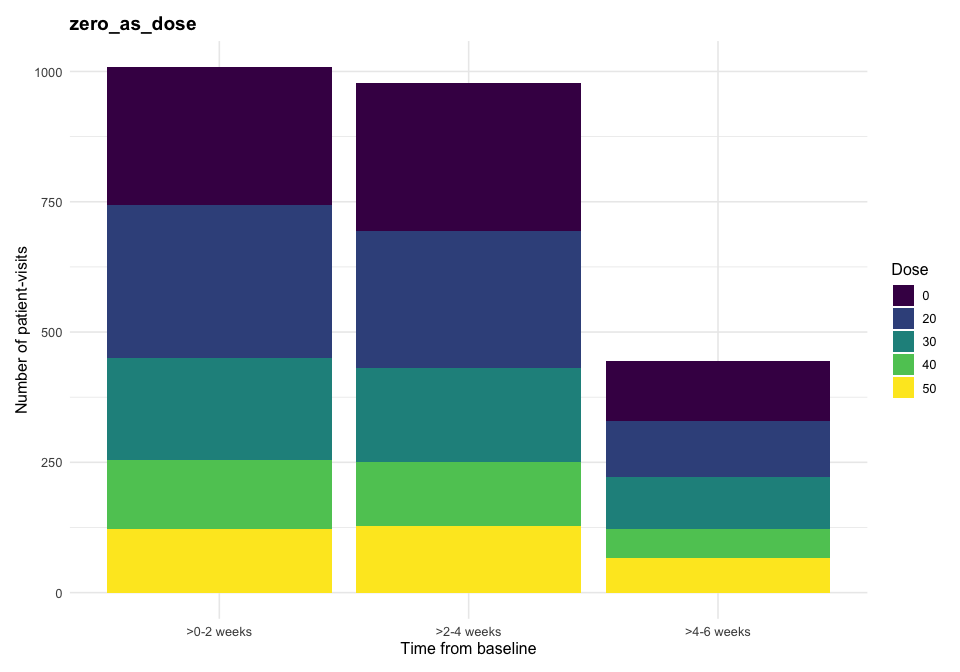
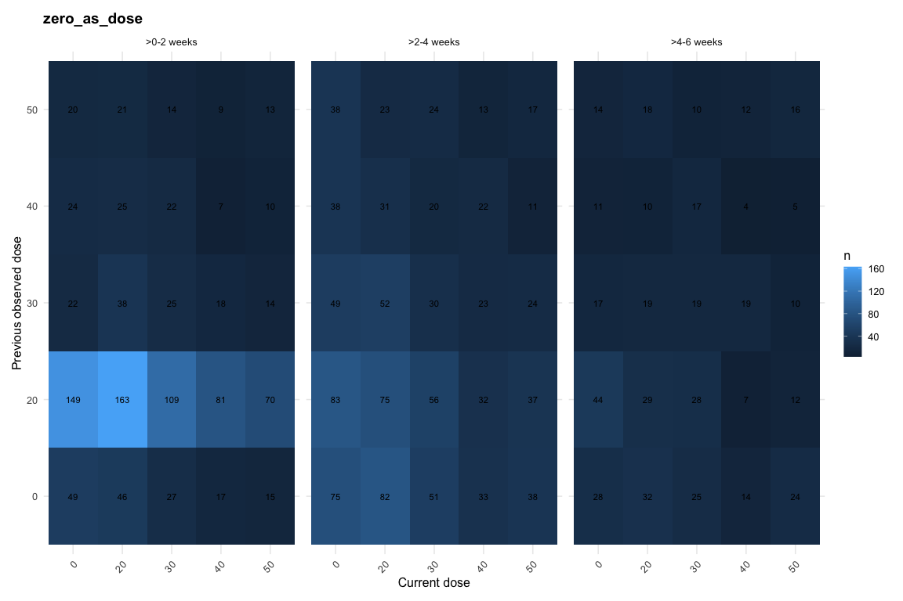
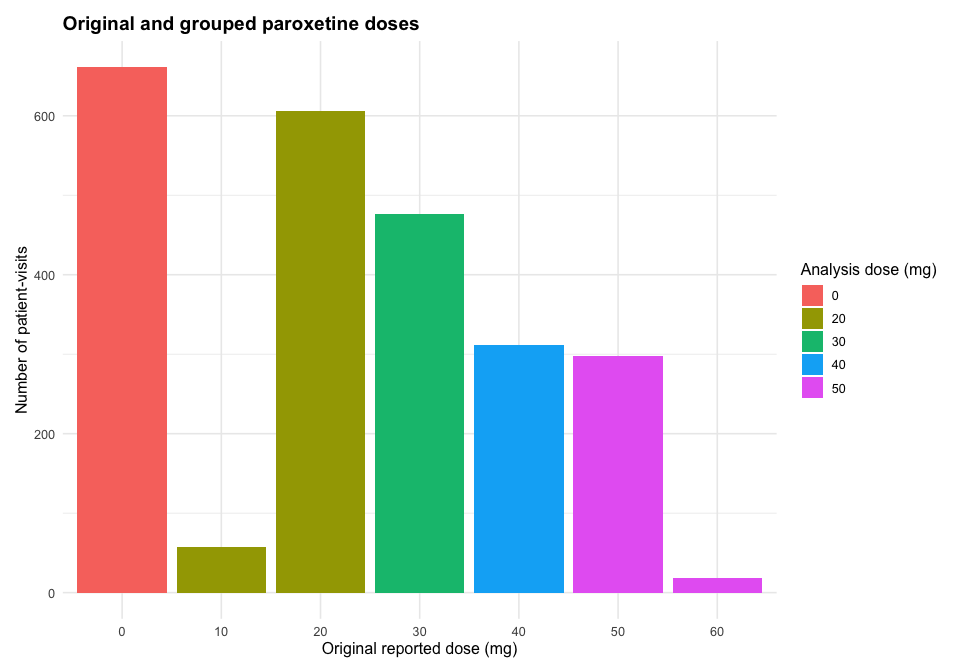
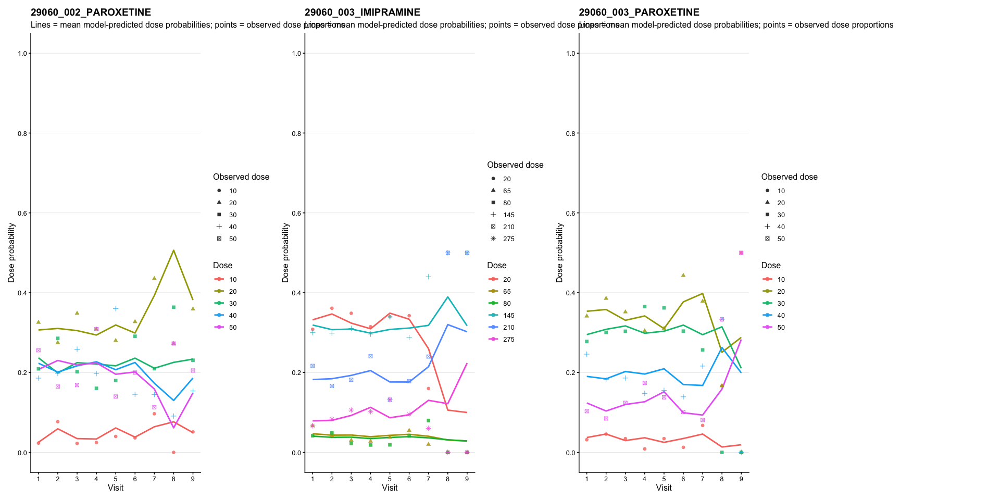
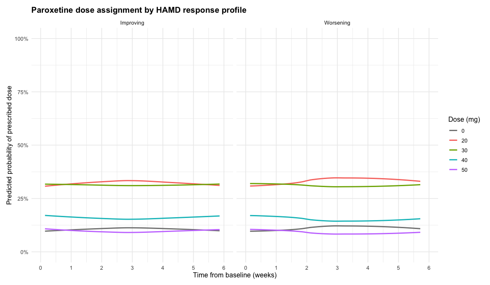
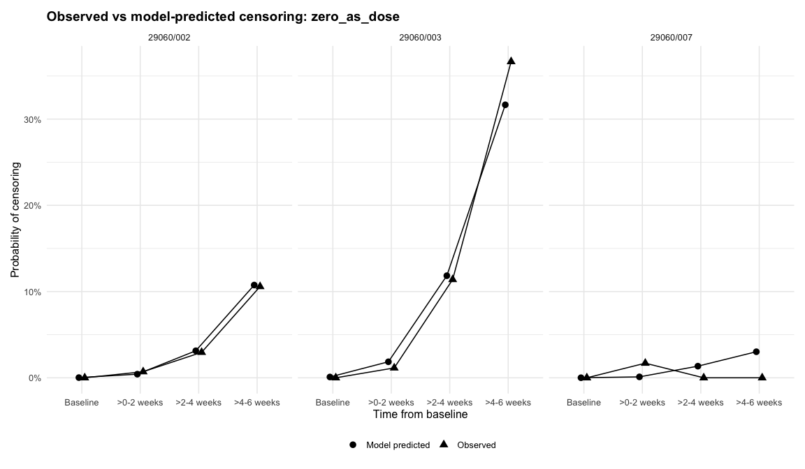
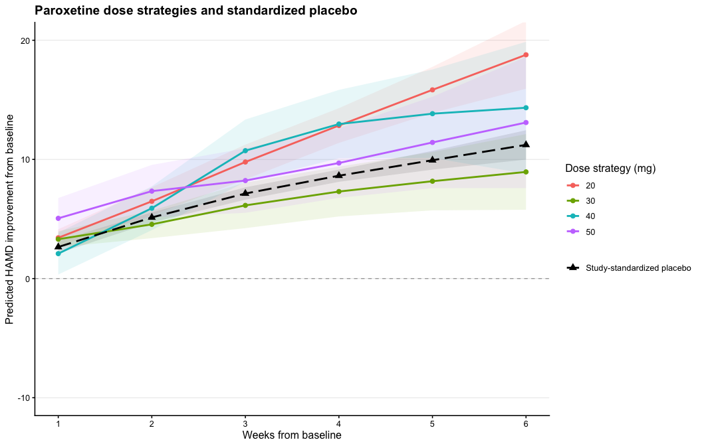
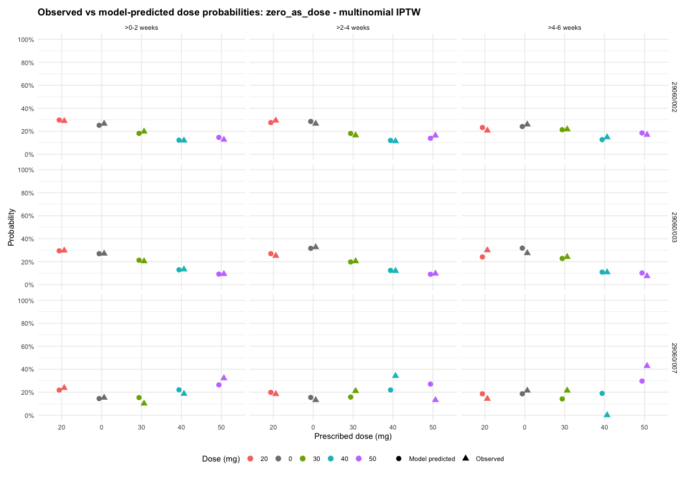
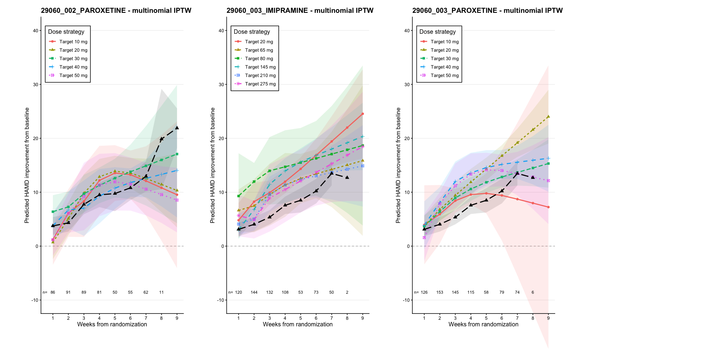
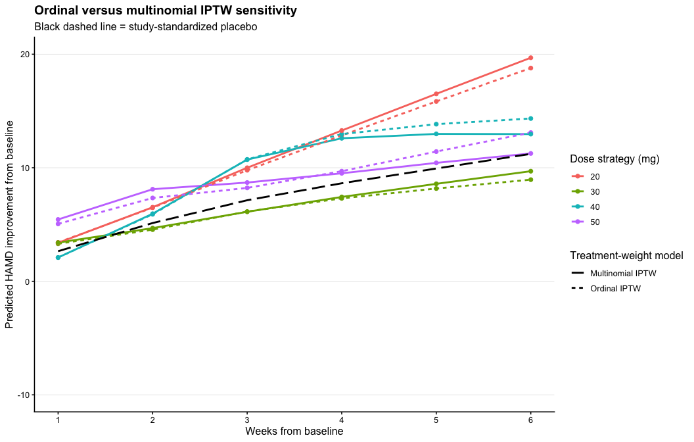

Flexible dose-response models
================

- [Clinical outcome, safety measure, time-varying confounders, and
  dataset](#clinical-outcome-safety-measure-time-varying-confounders-and-dataset)
  - [Empirical support and positivity
    diagnostics](#empirical-support-and-positivity-diagnostics)
- [Notation](#notation)
- [Step 1 - Inverse probability of dose and censoring weighting
  (IPDCW)](#step-1---inverse-probability-of-dose-and-censoring-weighting-ipdcw)
  - [Inverse probability of dose weights
    (IPTW)](#inverse-probability-of-dose-weights-iptw)
  - [Inverse probability of censoring weights
    (IPCW)](#inverse-probability-of-censoring-weights-ipcw)
  - [Total stabilized weights and
    truncation](#total-stabilized-weights-and-truncation)
- [Step 2 - Weighted repeated-measures marginal structural model
  MSM](#step-2---weighted-repeated-measures-marginal-structural-model-msm)
- [Step 3 - Standardized dose-strategy predictions and placebo
  comparison](#step-3---standardized-dose-strategy-predictions-and-placebo-comparison)
  - [What is the standardized
    population?](#what-is-the-standardized-population)
  - [Why the graph does not use the raw observed placebo
    mean](#why-the-graph-does-not-use-the-raw-observed-placebo-mean)
- [References](#references)
- [Appendix](#appendix)
  - [Alternative multinomial dose model for stabilized dose
    weights](#alternative-multinomial-dose-model-for-stabilized-dose-weights)
  - [Predicted trajectories using multinomial
    IPTW](#predicted-trajectories-using-multinomial-iptw)
  - [Comparison of ordinal and multinomial IPTW
    results](#comparison-of-ordinal-and-multinomial-iptw-results)

## Clinical outcome, safety measure, time-varying confounders, and dataset

The clinical outcome is the Hamilton Depression Rating Scale (HAMD)
score, denoted by $Y_{it}$, measured for patient $i$ at observation $t$.
The baseline HAMD score is denoted by $Y_{i0}$. Treatment response is
expressed as improvement from baseline:

``` math
\Delta Y_{it} = Y_{i0} - Y_{it}.
```

Thus, positive values of $\Delta Y_{it}$ indicate improvement.

The current analysis pools all eligible studies containing both
**PAROXETINE** and placebo. The primary analysis retains actual reported
study time and expresses it continuously in weeks. Follow-up for the
outcome analysis is restricted to day 42 (6 weeks), while the complete
available follow-up is retained to determine whether a patient truly had
no later observation (i.e., permanent loss to follow-up before the
analysis horizon).

The observed PAROXETINE dose is treated as a time-varying treatment.
Zero dose is retained as a genuine observed treatment state in the
treatment-assignment and dose-history models. Sparse dose support is
grouped before modelling; in the current data 10 mg is represented as 20
mg and 60 mg as 50 mg, while the original reported dose is preserved
separately. The clinically presented sustained strategies are 20, 30,
40, and 50 mg; the 0 mg strategy is not displayed in the final figures.

Safety is summarized using a side-effect score $S_{it}$ on a 0–10 scale,
denoting the number of relevant to PAROXETINE side effects reported. In
the current analysis these values are simulated.

Previous dose $d_{it-1}$ is part of the treatment process because it
defines the dose trajectory and strongly predicts the next assigned
dose. The post-baseline HAMD improvement $\Delta Y_{it}$ and side-effect
severity $S_{it}$ are treated as time-varying confounders because they
may be affected by previous treatment and may also influence subsequent
dose assignment, future outcome, or censoring.

| Number of active patients | Number of active patient-visits | Number of MSM patients | Number of MSM patient-visits | Observed dose levels (mg) |
|---:|---:|---:|---:|:---|
| 424 | 2853 | 416 | 1725 | 0, 20, 30, 40, 50 |

<small><em>Pooled PAROXETINE analysis summary</em></small>

| Study     | Number of active patients | Number of active patient-visits |
|:----------|--------------------------:|--------------------------------:|
| 29060/002 |                       170 |                            1300 |
| 29060/003 |                       241 |                            1419 |
| 29060/007 |                        13 |                             134 |

<small><em>Active-arm contribution by study</em></small>

### Empirical support and positivity diagnostics

Before interpreting the weighted marginal structural model, we assessed
empirical support for the observed dose process. Positivity requires
that, within the histories represented in the analysis, the dose
categories being compared have adequate observed support. Very sparse
dose levels, empty transition cells, or near-deterministic dose
assignment can produce unstable treatment weights and unreliable
extrapolation.

Broad time windows are used only for descriptive summaries and
diagnostic plots. All statistical models retain continuous study time.

<!-- -->

<!-- -->

<!-- -->

| Number of patients | Number of treatment-decision rows | Number of dose levels | Minimum patient-visits per dose | Observed dose levels (mg) |
|---:|---:|---:|---:|:---|
| 422 | 2308 | 5 | 296 | 0, 20, 30, 40, 50 |

<small><em>Support check for the pooled active analysis</em></small>

## Notation

<table class="notation-table">
<thead>
<tr>
<th>
Notation
</th>
<th>
Explanation
</th>
</tr>
</thead>
<tbody>
<tr>
<td>
$i = 1,\ldots,n$
</td>
<td>
Patient index.
</td>
</tr>
<tr>
<td>
$t$
</td>
<td>
Ordered observation/decision index for patient $i$; baseline is the
first observation.
</td>
</tr>
<tr>
<td>
$\mathrm{week}_{it}$
</td>
<td>
Actual continuous study week of observation $t$ for patient $i$.
</td>
</tr>
<tr>
<td>
$g_i$
</td>
<td>
Study identifier for patient $i$, entered as a fixed effect.
</td>
</tr>
<tr>
<td>
$Y_{it}$
</td>
<td>
HAMD score for patient $i$ at observation $t$.
</td>
</tr>
<tr>
<td>
$\Delta Y_{it} = Y_{i0} - Y_{it}$
</td>
<td>
HAMD improvement from baseline. Positive values indicate improvement.
</td>
</tr>
<tr>
<td>
$S_{it}$
</td>
<td>
Side-effect score for patient $i$ at observation $t$.
</td>
</tr>
<tr>
<td>
$d_{it}$
</td>
<td>
Observed dose assigned at observation $t$.
</td>
</tr>
<tr>
<td>
$R_{it+1}$
</td>
<td>
Indicator of remaining uncensored after observation $t$. It is 0 only
when no later observation exists in the full available follow-up before
the 6-week horizon; it is not defined after the analysis horizon.
</td>
</tr>
<tr>
<td>
$\hat p_{it}^{D}$
</td>
<td>
Fitted denominator probability of the observed dose.
</td>
</tr>
<tr>
<td>
$\hat q_{it}^{D}$
</td>
<td>
Fitted numerator probability of the observed dose.
</td>
</tr>
<tr>
<td>
$\mathrm{SW}_{it}^{D}$
</td>
<td>
Visit-specific stabilized dose weight.
</td>
</tr>
<tr>
<td>
$\mathrm{cSW}_{it}^{D}$
</td>
<td>
Cumulative stabilized dose weight applied to the outcome at observation
$t$, based on treatment decisions before that outcome.
</td>
</tr>
<tr>
<td>
$\hat p_{it}^{C}$
</td>
<td>
Fitted denominator probability of remaining uncensored after observation
$t$.
</td>
</tr>
<tr>
<td>
$\hat q_{it}^{C}$
</td>
<td>
Fitted numerator probability of remaining uncensored after observation
$t$.
</td>
</tr>
<tr>
<td>
$\mathrm{SW}_{it}^{C}$
</td>
<td>
Visit-specific stabilized censoring weight.
</td>
</tr>
<tr>
<td>
$\mathrm{cSW}_{it}^{C}$
</td>
<td>
Cumulative stabilized censoring weight applied to the outcome at
observation $t$, based on preceding censoring intervals.
</td>
</tr>
<tr>
<td>
$\mathrm{SW}_{it}^{\mathrm{total}}$
</td>
<td>
Final stabilized treatment-by-censoring weight.
</td>
</tr>
</tbody>
</table>

## Step 1 - Inverse probability of dose and censoring weighting (IPDCW)

### Inverse probability of dose weights (IPTW)

The first step is to construct stabilized inverse probability of dose
weights to adjust for time-varying confounding affected by prior dose,
following Robins, Hernán and Brumback (2000).

The **denominator model** represents the full observed dose-assignment
mechanism. The **numerator model** is a reduced model used to stabilize
the weights. Both models include study as a fixed effect because the
analysis pools patients from several trials.

#### Dose weight denominator

The **denominator model** the dose weight was fitted at the
patient-visit level using ordinal logistic regression, treating dose as
an ordered categorical variable (0\<20\<30\<40\<50). For each threshold
d∈{0,20,30,40}, we modelled the cumulative probability of receiving a
dose less than or equal to d.

``` math
\begin{aligned}
\mathrm{logit}
\left\{
\Pr(D_{it} \le c \mid H_{it})
\right\}
&=
\alpha_{0c}
+ \alpha_1 f(\mathrm{week}_{it})
+ \alpha_2 study_i
+ \alpha_3 \Delta Y_{it}
+ \alpha_4 S_{it}
+ \alpha_5 d_{it-1} \\
&\quad
+ \alpha_6 d_{it-1}\Delta Y_{it}
+ \alpha_7 d_{it-1}S_{it}
+ \alpha_8 Y_{i0}.
\end{aligned}
```

The restricted cubic spline $f(\mathrm{week}_{it})$ allows the
dose-assignment process to vary non-linearly over actual continuous
study time. Previous dose is represented categorically. The interactions
with previous dose allow the same efficacy or side-effect information to
lead to different dose decisions depending on the dose already received.

The denominator probability used in the weight is the fitted probability
of the dose actually assigned:

``` math
\hat p_{it}^{D}
=
\widehat{\Pr}
\left(
D_{it}=d_{it}
\mid
H_{it}
\right).
```

|                                       |  Value | Std. Error | t value | p_value |
|:--------------------------------------|-------:|-----------:|--------:|--------:|
| rms::rcs(visit, 3)visit               | -0.120 |      0.092 |  -1.297 |   0.195 |
| rms::rcs(visit, 3)visit’              |  0.150 |      0.133 |   1.125 |   0.260 |
| studyid29060/003                      | -0.216 |      0.081 |  -2.656 |   0.008 |
| studyid29060/007                      |  0.596 |      0.195 |   3.051 |   0.002 |
| delta_outcome_locf                    |  0.005 |      0.010 |   0.471 |   0.638 |
| side.effects_model_locf               | -0.454 |      0.025 | -18.418 |   0.000 |
| dose_lag1_f20                         | -0.017 |      0.206 |  -0.080 |   0.936 |
| dose_lag1_f30                         |  0.021 |      0.252 |   0.084 |   0.933 |
| dose_lag1_f40                         |  0.111 |      0.284 |   0.393 |   0.694 |
| dose_lag1_f50                         |  0.190 |      0.276 |   0.687 |   0.492 |
| outcome_0                             |  0.014 |      0.010 |   1.378 |   0.168 |
| delta_outcome_locf:dose_lag1_f20      | -0.016 |      0.012 |  -1.390 |   0.165 |
| delta_outcome_locf:dose_lag1_f30      | -0.004 |      0.015 |  -0.297 |   0.766 |
| delta_outcome_locf:dose_lag1_f40      | -0.005 |      0.016 |  -0.303 |   0.762 |
| delta_outcome_locf:dose_lag1_f50      |  0.022 |      0.016 |   1.363 |   0.173 |
| side.effects_model_locf:dose_lag1_f20 |  0.001 |      0.029 |   0.038 |   0.970 |
| side.effects_model_locf:dose_lag1_f30 |  0.017 |      0.036 |   0.476 |   0.634 |
| side.effects_model_locf:dose_lag1_f40 | -0.060 |      0.043 |  -1.415 |   0.157 |
| side.effects_model_locf:dose_lag1_f50 | -0.062 |      0.041 |  -1.514 |   0.130 |
| 0\|20                                 | -3.878 |      0.367 | -10.572 |   0.000 |
| 20\|30                                | -2.015 |      0.360 |  -5.590 |   0.000 |
| 30\|40                                | -0.649 |      0.358 |  -1.814 |   0.070 |
| 40\|50                                |  0.530 |      0.359 |   1.478 |   0.139 |

<small><em>Coefficient table for the ordinal dose-weight
denominator</em></small>

The observed-versus-predicted diagnostic compares the empirical
proportion assigned to each dose with the mean model-predicted
probability, within study and broad time window.

<!-- -->

The response-profile diagnostic is descriptive. It compares fitted
dose-assignment probabilities among observed patient-visits with
different response histories while setting the side-effect score to the
same value in the displayed profiles.

<!-- -->

#### Dose weight numerator

The numerator excludes the time-varying confounders while retaining
continuous time, study, previous dose, and baseline HAMD:

``` math
\begin{aligned}
\mathrm{logit}
\left\{
\Pr(D_{it} \le c \mid H_{it}^{*})
\right\}
&=
\beta_{0c}
+ \beta_1 f(\mathrm{week}_{it})
+ \beta_2 study_i
+ \beta_3 d_{it-1}
+ \beta_4 Y_{i0}.
\end{aligned}
```

The fitted probability corresponding to the observed dose is

``` math
\hat q_{it}^{D}
=
\widehat{\Pr}
\left(
D_{it}=d_{it}
\mid
H_{it}^{*}
\right).
```

|                          |  Value | Std. Error | t value | p_value |
|:-------------------------|-------:|-----------:|--------:|--------:|
| rms::rcs(visit, 3)visit  | -0.184 |      0.084 |  -2.176 |   0.030 |
| rms::rcs(visit, 3)visit’ |  0.287 |      0.124 |   2.313 |   0.021 |
| studyid29060/003         | -0.192 |      0.077 |  -2.503 |   0.012 |
| studyid29060/007         |  0.817 |      0.183 |   4.451 |   0.000 |
| dose_lag1_f20            | -0.060 |      0.102 |  -0.588 |   0.557 |
| dose_lag1_f30            |  0.138 |      0.122 |   1.133 |   0.257 |
| dose_lag1_f40            | -0.137 |      0.139 |  -0.983 |   0.326 |
| dose_lag1_f50            |  0.069 |      0.141 |   0.491 |   0.624 |
| outcome_0                |  0.001 |      0.008 |   0.176 |   0.860 |
| 0\|20                    | -1.288 |      0.281 |  -4.593 |   0.000 |
| 20\|30                   | -0.109 |      0.279 |  -0.389 |   0.697 |
| 30\|40                   |  0.775 |      0.280 |   2.766 |   0.006 |
| 40\|50                   |  1.641 |      0.283 |   5.806 |   0.000 |

<small><em>Coefficient table for the ordinal dose-weight
numerator</em></small>

#### Stabilized dose weights and timing

The visit-specific stabilized dose weight is

``` math
\mathrm{SW}_{it}^{D}
=
\frac{
\hat q_{it}^{D}
}{
\hat p_{it}^{D}
}.
```

HAMD and side effects are observed at a visit before the dose prescribed
at that visit is used for the next treatment interval. Therefore the
treatment weight estimated from the dose decision at observation $t$ is
applied to **subsequent** outcomes, not to the outcome already measured
at observation $t$. The cumulative treatment weight attached to outcome
$t$ is therefore

``` math
\mathrm{cSW}_{it}^{D}
=
\prod_{s < t}
\mathrm{SW}_{is}^{D}.
```

This temporal alignment differs from multiplying the current decision
weight into the same-row outcome.

| Number of treatment-decision rows | Number of patients | Mean visit-specific weight | SD visit-specific weight | Minimum visit-specific weight | 1st percentile visit-specific weight | Median visit-specific weight | 99th percentile visit-specific weight | Maximum visit-specific weight | Mean cumulative weight | SD cumulative weight | Minimum cumulative weight | 1st percentile cumulative weight | Median cumulative weight | 99th percentile cumulative weight | Maximum cumulative weight | Effective sample size |
|---:|---:|---:|---:|---:|---:|---:|---:|---:|---:|---:|---:|---:|---:|---:|---:|---:|
| 2308 | 422 | 0.973 | 1.292 | 0.197 | 0.281 | 0.665 | 6.094 | 20.238 | 0.832 | 1.384 | 0.001 | 0.011 | 0.583 | 5.614 | 30.6 | 612.368 |

<small><em>Summary of visit-specific and cumulative stabilized dose
weights</em></small>

| Number of treatment-decision rows | Number of patients | Minimum predicted probability | 1st percentile predicted probability | 5th percentile predicted probability | Median predicted probability | Mean predicted probability | Number with probability \< 0.01 | Percent with probability \< 0.01 | Number with probability \< 0.05 | Percent with probability \< 0.05 |
|---:|---:|---:|---:|---:|---:|---:|---:|---:|---:|---:|
| 2308 | 422 | 0.005 | 0.03 | 0.08 | 0.309 | 0.344 | 3 | 0.13 | 58 | 2.513 |

<small><em>Ordinal treatment-model positivity diagnostics</em></small>

The ordinal model assumes proportional odds: covariates shift the
probability toward higher or lower dose categories similarly across
cumulative dose thresholds. This assumption is examined in the Appendix
using a multinomial treatment model.

### Inverse probability of censoring weights (IPCW)

Censoring is defined using all available follow-up, not merely the
absence of an observation at the next nominal week. For an observation
before week 6, $R_{it+1}=0$ only when the patient has no later
observation anywhere in the complete available follow-up. Thus irregular
visit spacing by itself does not define censoring.

#### Censoring weight denominator

The denominator model includes study, a restricted cubic spline of
continuous time, current dose, current and previous HAMD improvement,
current and previous side-effect scores, baseline HAMD, age, and sex:

``` math
\begin{aligned}
\mathrm{logit}
\left\{
\Pr(R_{it+1}=1 \mid H_{it}^{C})
\right\}
&=
\gamma_0
+ \gamma_1 f(\mathrm{week}_{it})
+ \gamma_2 g´study_i
+ \gamma_3 d_{it}
+ \gamma_4 \Delta Y_{it}
+ \gamma_5 \Delta Y_{it-1} \\
&\quad
+ \gamma_6 S_{it}
+ \gamma_7 S_{it-1}
+ \gamma_8 Y_{i0}
+ \gamma_9 \mathrm{age}_i
+ \gamma_{10} \mathrm{sex}_i.
\end{aligned}
```

|                          | Estimate | Std. Error | z value | Pr(\>\|z\|) | p_value |
|:-------------------------|---------:|-----------:|--------:|------------:|--------:|
| (Intercept)              |    8.178 |      1.285 |   6.365 |       0.000 |   0.000 |
| studyid29060/003         |   -1.385 |      0.215 |  -6.450 |       0.000 |   0.000 |
| studyid29060/007         |    1.157 |      1.031 |   1.122 |       0.262 |   0.262 |
| rms::rcs(visit, 3)visit  |   -2.199 |      0.532 |  -4.134 |       0.000 |   0.000 |
| rms::rcs(visit, 3)visit’ |    1.047 |      0.414 |   2.531 |       0.011 |   0.011 |
| dose_censor_f20          |   -0.331 |      0.281 |  -1.176 |       0.239 |   0.239 |
| dose_censor_f30          |   -0.590 |      0.310 |  -1.901 |       0.057 |   0.057 |
| dose_censor_f40          |   -0.627 |      0.379 |  -1.655 |       0.098 |   0.098 |
| dose_censor_f50          |   -0.042 |      0.439 |  -0.096 |       0.924 |   0.924 |
| delta_outcome_locf       |    0.002 |      0.013 |   0.130 |       0.897 |   0.897 |
| delta_outcome_lag1       |    0.015 |      0.013 |   1.175 |       0.240 |   0.240 |
| side.effects_model_locf  |    0.012 |      0.035 |   0.342 |       0.733 |   0.733 |
| side.effects_lag1        |   -0.006 |      0.026 |  -0.214 |       0.830 |   0.830 |
| outcome_0                |   -0.016 |      0.026 |  -0.626 |       0.532 |   0.532 |
| age                      |    0.024 |      0.009 |   2.607 |       0.009 |   0.009 |
| sexM                     |    0.040 |      0.189 |   0.211 |       0.833 |   0.833 |

<small><em>Coefficient table for the censoring-weight
denominator</em></small>

<!-- -->

#### Censoring weight numerator

The numerator excludes the time-varying efficacy and side-effect
histories but retains study, continuous time, current dose, baseline
HAMD, age, and sex:

``` math
\begin{aligned}
\mathrm{logit}
\left\{
\Pr(R_{it+1}=1 \mid H_{it}^{C*})
\right\}
&=
\delta_0
+ \delta_1 f(\mathrm{week}_{it})
+ \delta_2 study_i
+ \delta_3 d_{it}
+ \delta_4 Y_{i0}
+ \delta_5 \mathrm{age}_i
+ \delta_6 \mathrm{sex}_i.
\end{aligned}
```

|                          | Estimate | Std. Error | z value | Pr(\>\|z\|) | p_value |
|:-------------------------|---------:|-----------:|--------:|------------:|--------:|
| (Intercept)              |    7.820 |      1.178 |   6.641 |       0.000 |   0.000 |
| studyid29060/003         |   -1.372 |      0.213 |  -6.428 |       0.000 |   0.000 |
| studyid29060/007         |    1.207 |      1.030 |   1.172 |       0.241 |   0.241 |
| rms::rcs(visit, 3)visit  |   -2.139 |      0.519 |  -4.122 |       0.000 |   0.000 |
| rms::rcs(visit, 3)visit’ |    1.022 |      0.406 |   2.518 |       0.012 |   0.012 |
| dose_censor_f20          |   -0.372 |      0.265 |  -1.407 |       0.159 |   0.159 |
| dose_censor_f30          |   -0.652 |      0.269 |  -2.420 |       0.016 |   0.016 |
| dose_censor_f40          |   -0.682 |      0.313 |  -2.179 |       0.029 |   0.029 |
| dose_censor_f50          |   -0.138 |      0.357 |  -0.385 |       0.700 |   0.700 |
| outcome_0                |   -0.001 |      0.021 |  -0.049 |       0.961 |   0.961 |
| age                      |    0.024 |      0.009 |   2.561 |       0.010 |   0.010 |
| sexM                     |    0.044 |      0.189 |   0.234 |       0.815 |   0.815 |

<small><em>Coefficient table for the censoring-weight
numerator</em></small>

#### Stabilized censoring weights and timing

The visit-specific censoring weight is

``` math
\mathrm{SW}_{it}^{C}
=
\frac{
\hat q_{it}^{C}
}{
\hat p_{it}^{C}
}.
```

As with treatment assignment, censoring after observation $t$ can affect
later outcomes but cannot affect the outcome already observed at $t$.
The cumulative censoring weight applied to outcome $t$ is therefore

``` math
\mathrm{cSW}_{it}^{C}
=
\prod_{s < t}
\mathrm{SW}_{is}^{C}.
```

| Number of censoring-model rows | Number of patients | Mean visit-specific weight | SD visit-specific weight | Minimum visit-specific weight | 1st percentile visit-specific weight | Median visit-specific weight | 99th percentile visit-specific weight | Maximum visit-specific weight | Mean cumulative weight | SD cumulative weight | Minimum cumulative weight | 1st percentile cumulative weight | Median cumulative weight | 99th percentile cumulative weight | Maximum cumulative weight | Effective sample size |
|---:|---:|---:|---:|---:|---:|---:|---:|---:|---:|---:|---:|---:|---:|---:|---:|---:|
| 2732 | 424 | 1 | 0.012 | 0.924 | 0.964 | 1 | 1.044 | 1.163 | 1 | 0.01 | 0.875 | 0.969 | 1 | 1.034 | 1.154 | 2731.709 |

<small><em>Summary of stabilized censoring weights</em></small>

### Total stabilized weights and truncation

The final observation-level weight is

``` math
\mathrm{SW}_{it}^{\mathrm{total}}
=
\mathrm{cSW}_{it}^{D}
\times
\mathrm{cSW}_{it}^{C}.
```

The total weight, rather than its treatment and censoring components
separately, is truncated at the 1st and 99th percentiles. Weight
stability is assessed using the distribution of the weights and the Kish
effective sample size,

``` math
\mathrm{ESS}
=
\frac{
\left(
\sum_{i,t}
\mathrm{SW}_{it}^{\mathrm{total}}
\right)^2
}{
\sum_{i,t}
\left(
\mathrm{SW}_{it}^{\mathrm{total}}
\right)^2
}.
```

| Number of MSM patient-visits | Number of patients | Mean total weight | SD total weight | Minimum total weight | 1st percentile total weight | Median total weight | 99th percentile total weight | Maximum total weight | Effective sample size |
|---:|---:|---:|---:|---:|---:|---:|---:|---:|---:|
| 1725 | 416 | 0.839 | 1.337 | 0.001 | 0.01 | 0.595 | 5.544 | 30.559 | 487.79 |

<small><em>Summary of untruncated total stabilized weights</em></small>

| Number of MSM patient-visits | Number of patients | Mean truncated total weight | SD truncated total weight | Minimum truncated total weight | 1st percentile truncated total weight | Median truncated total weight | 99th percentile truncated total weight | Maximum truncated total weight | Effective sample size |
|---:|---:|---:|---:|---:|---:|---:|---:|---:|---:|
| 1725 | 416 | 0.793 | 0.896 | 0.01 | 0.01 | 0.595 | 5.542 | 5.544 | 758.558 |

<small><em>Summary of total stabilized weights after 1st/99th percentile
truncation</em></small>

## Step 2 - Weighted repeated-measures marginal structural model MSM

After estimating the total weights, we fit a weighted repeated-measures
marginal structural model using generalized estimating equations with an
identity link and Gaussian working variance. An independence working
correlation structure is used, with robust sandwich standard errors
clustered by patient.

The outcome model includes a restricted cubic spline of continuous study
week, baseline HAMD, the three most recent dose-history variables, the
average earlier dose, and study as a fixed effect. The most recent dose
is allowed to interact with time, and baseline HAMD is also allowed to
interact with time:

``` math
\begin{aligned}
\Delta Y_{it}
&=
\eta_{0}
+ \eta_{1} f(\mathrm{week}_{it})
+ \eta_{2} Y_{i0}
+ \eta_{3} d_{it-1}
+ \eta_{4} d_{it-2} \\
&\quad
+ \eta_{5} d_{it-3}
+ \eta_{6} \overline{d}_{i\lt t-3}
+ \eta_{7} Y_{i0} f(\mathrm{week}_{it}) \\ 
&\quad 
+ \eta_{8}\!\left(d_{it-1}, f(\mathrm{week}_{it})\right)
+ \eta_9 g_i
+ \varepsilon_{it}.
\end{aligned}
```

The recent dose variables $d_{it-1}$, $d_{it-2}$, and $d_{it-3}$ are
represented categorically using the analysis dose levels. Patients were
untreated before study entry, so structural pre-baseline dose history is
represented by 0 mg. The average earlier dose $\overline d_{i<t-3}$ is
kept continuous.

The study fixed effect allows the mean outcome level to differ across
studies while estimating a pooled PAROXETINE dose-response relation.

| Term | Estimate | Naive_SE | Robust_SE | Wald_robust | p_value_robust |
|:---|---:|---:|---:|---:|---:|
| (Intercept) | -19.126 | 3.919 | 4.986 | 14.717 | 0.000 |
| rms::rcs(visit, 3)visit | -1.195 | 2.184 | 2.736 | 0.191 | 0.662 |
| rms::rcs(visit, 3)visit’ | 7.768 | 3.820 | 5.426 | 2.049 | 0.152 |
| outcome_0 | 0.701 | 0.127 | 0.134 | 27.182 | 0.000 |
| dose_lag1_f20 | 0.270 | 2.148 | 5.148 | 0.003 | 0.958 |
| dose_lag1_f30 | 0.156 | 2.781 | 5.445 | 0.001 | 0.977 |
| dose_lag1_f40 | -7.537 | 3.231 | 6.977 | 1.167 | 0.280 |
| dose_lag1_f50 | 8.345 | 3.405 | 6.758 | 1.525 | 0.217 |
| dose_lag2_f20 | -0.195 | 0.505 | 0.591 | 0.109 | 0.741 |
| dose_lag2_f30 | -2.954 | 0.648 | 0.957 | 9.539 | 0.002 |
| dose_lag2_f40 | -0.866 | 0.851 | 0.967 | 0.801 | 0.371 |
| dose_lag2_f50 | -1.864 | 0.902 | 0.976 | 3.646 | 0.056 |
| dose_lag3_f20 | -0.050 | 0.510 | 0.621 | 0.006 | 0.936 |
| dose_lag3_f30 | -0.874 | 0.779 | 1.150 | 0.578 | 0.447 |
| dose_lag3_f40 | 0.919 | 0.974 | 1.180 | 0.607 | 0.436 |
| dose_lag3_f50 | -0.703 | 1.099 | 1.191 | 0.349 | 0.555 |
| avg_dose_before_lag3 | 0.046 | 0.025 | 0.028 | 2.610 | 0.106 |
| studyid29060/003 | 1.073 | 0.390 | 0.516 | 4.323 | 0.038 |
| studyid29060/007 | 1.049 | 1.011 | 0.822 | 1.627 | 0.202 |
| rms::rcs(visit, 3)visit:outcome_0 | 0.165 | 0.074 | 0.085 | 3.758 | 0.053 |
| rms::rcs(visit, 3)visit’:outcome_0 | -0.344 | 0.135 | 0.168 | 4.189 | 0.041 |
| rms::rcs(visit, 3)visit:dose_lag1_f20 | -0.238 | 1.118 | 2.408 | 0.010 | 0.921 |
| rms::rcs(visit, 3)visit’:dose_lag1_f20 | 1.370 | 1.779 | 3.558 | 0.148 | 0.700 |
| rms::rcs(visit, 3)visit:dose_lag1_f30 | -0.143 | 1.418 | 2.581 | 0.003 | 0.956 |
| rms::rcs(visit, 3)visit’:dose_lag1_f30 | -0.936 | 2.186 | 3.805 | 0.061 | 0.806 |
| rms::rcs(visit, 3)visit:dose_lag1_f40 | 3.604 | 1.687 | 3.341 | 1.163 | 0.281 |
| rms::rcs(visit, 3)visit’:dose_lag1_f40 | -5.175 | 2.706 | 4.830 | 1.148 | 0.284 |
| rms::rcs(visit, 3)visit:dose_lag1_f50 | -3.223 | 1.757 | 3.289 | 0.960 | 0.327 |
| rms::rcs(visit, 3)visit’:dose_lag1_f50 | 3.138 | 2.683 | 4.891 | 0.412 | 0.521 |

<small><em>Weighted marginal structural model for HAMD
improvement</em></small>

## Step 3 - Standardized dose-strategy predictions and placebo comparison

After fitting the weighted MSM, we predict HAMD improvement at weeks 1–6
under sustained PAROXETINE strategies. All patients were untreated
before study entry and the observed trials initiated PAROXETINE at 20
mg. Therefore the intervention histories used for prediction start with
20 mg at baseline. For the 20 mg strategy, treatment remains at 20 mg.
For the 30, 40, and 50 mg strategies, treatment starts at 20 mg at
baseline and is then set to the target dose at subsequent
treatment-decision occasions.

The final figures present the clinically relevant 20, 30, 40, and 50 mg
strategies. Zero dose remains part of the observed treatment process and
therefore remains in the IPTW and dose-history models, but the 0 mg
strategy is not displayed as a target intervention.

### What is the standardized population?

Predictions are not calculated for one artificial patient with a mean
baseline HAMD score. Instead, each strategy is evaluated for every
patient in the active MSM population using that patient’s observed
baseline HAMD and study membership. The patient-specific model
predictions are then averaged.

For strategy $a$ at week $t$, the standardized mean is

``` math
\widehat{\mu}_{a}(t)
=
\frac{1}{N}
\sum_{i=1}^{N}
\widehat{Y}_{i}^{\,a}(t).
```

Thus, **standardized** means that every treatment strategy is evaluated
over the same empirical target population. In the current data this is
the set of active patients contributing to the MSM. The comparison
between dose strategies is therefore not driven by one strategy being
evaluated in a different mix of studies or in patients with a different
baseline HAMD distribution.

The counterfactual dose histories use each patient’s empirical
treatment-decision/visit structure before the target week, while dose
itself is replaced by the specified strategy. Predictions at each target
week are averaged across the full active MSM target population.

### Why the graph does not use the raw observed placebo mean

A raw observed placebo mean at an exact integer week would use only
placebo patients who happened to have an observation exactly at that
time. With continuously recorded visit times, these exact-week cells can
be sparse, particularly in smaller studies. In addition, a simple pooled
placebo mean can have a different study composition and baseline-HAMD
distribution from the active MSM target population.

For this reason, all available placebo observations through week 6 are
first used to fit a separate placebo GEE:

``` math
\Delta Y_{it}^{P}
=
\theta_0
+ \theta_1 f(\mathrm{week}_{it})
+ \theta_2 Y_{i0}
+ \theta_3 Y_{i0}f(\mathrm{week}_{it})
+ \theta_4 g_i
+ \varepsilon_{it}.
```

The placebo model is then predicted at weeks 1–6 using the **same study
membership and baseline HAMD values as the active MSM target
population**, and these predictions are averaged. The black curve is
therefore a **standardized placebo prediction**, estimated from the
observed placebo data but transported to the same target population used
for the active strategies. This makes the active-versus-placebo
comparison more comparable and avoids relying on sparse exact-week
placebo cells.

Pointwise 95% confidence intervals for active strategies are calculated
from the robust GEE covariance matrix. The active-versus-placebo
standard error combines the active and placebo prediction standard
errors. These intervals do not propagate uncertainty from estimation of
the treatment and censoring weights; a full bootstrap would be required
for that additional uncertainty.

<!-- -->

| Week | Dose strategy | Strategy dose (mg) | Active standardization population | Placebo standardization population | Predicted active improvement | SE active prediction | Active 95% CI lower | Active 95% CI upper | Standardized placebo improvement | SE standardized placebo | Placebo 95% CI lower | Placebo 95% CI upper | Active - placebo difference | SE of difference | Difference 95% CI lower | Difference 95% CI upper |
|---:|:---|---:|---:|---:|---:|---:|---:|---:|---:|---:|---:|---:|---:|---:|---:|---:|
| 1 | 20 mg | 20 | 416 | 416 | 3.424 | 0.364 | 2.710 | 4.137 | 2.649 | 0.274 | 2.113 | 3.185 | 0.775 | 0.455 | -0.118 | 1.667 |
| 2 | 20 mg | 20 | 416 | 416 | 6.482 | 0.600 | 5.306 | 7.659 | 5.131 | 0.214 | 4.711 | 5.551 | 1.351 | 0.637 | 0.102 | 2.601 |
| 3 | 20 mg | 20 | 416 | 416 | 9.782 | 0.745 | 8.323 | 11.241 | 7.138 | 0.265 | 6.619 | 7.658 | 2.644 | 0.790 | 1.095 | 4.193 |
| 4 | 20 mg | 20 | 416 | 416 | 12.844 | 0.743 | 11.387 | 14.300 | 8.633 | 0.261 | 8.121 | 9.144 | 4.211 | 0.788 | 2.667 | 5.755 |
| 5 | 20 mg | 20 | 416 | 416 | 15.838 | 0.987 | 13.904 | 17.771 | 9.932 | 0.403 | 9.143 | 10.721 | 5.905 | 1.066 | 3.817 | 7.994 |
| 6 | 20 mg | 20 | 416 | 416 | 18.781 | 1.453 | 15.933 | 21.628 | 11.221 | 0.627 | 9.992 | 12.451 | 7.559 | 1.583 | 4.458 | 10.661 |
| 1 | 30 mg | 30 | 416 | 416 | 3.305 | 0.342 | 2.634 | 3.975 | 2.649 | 0.274 | 2.113 | 3.185 | 0.655 | 0.438 | -0.203 | 1.514 |
| 2 | 30 mg | 30 | 416 | 416 | 4.551 | 0.592 | 3.391 | 5.711 | 5.131 | 0.214 | 4.711 | 5.551 | -0.580 | 0.630 | -1.814 | 0.654 |
| 3 | 30 mg | 30 | 416 | 416 | 6.142 | 0.974 | 4.232 | 8.051 | 7.138 | 0.265 | 6.619 | 7.658 | -0.997 | 1.010 | -2.975 | 0.982 |
| 4 | 30 mg | 30 | 416 | 416 | 7.304 | 1.067 | 5.212 | 9.395 | 8.633 | 0.261 | 8.121 | 9.144 | -1.329 | 1.098 | -3.482 | 0.824 |
| 5 | 30 mg | 30 | 416 | 416 | 8.171 | 1.248 | 5.724 | 10.617 | 9.932 | 0.403 | 9.143 | 10.721 | -1.761 | 1.312 | -4.332 | 0.809 |
| 6 | 30 mg | 30 | 416 | 416 | 8.951 | 1.620 | 5.776 | 12.126 | 11.221 | 0.627 | 9.992 | 12.451 | -2.270 | 1.737 | -5.675 | 1.135 |
| 1 | 40 mg | 40 | 416 | 416 | 2.092 | 0.895 | 0.338 | 3.847 | 2.649 | 0.274 | 2.113 | 3.185 | -0.557 | 0.936 | -2.392 | 1.278 |
| 2 | 40 mg | 40 | 416 | 416 | 5.903 | 0.938 | 4.064 | 7.741 | 5.131 | 0.214 | 4.711 | 5.551 | 0.772 | 0.962 | -1.114 | 2.658 |
| 3 | 40 mg | 40 | 416 | 416 | 10.733 | 1.335 | 8.118 | 13.349 | 7.138 | 0.265 | 6.619 | 7.658 | 3.595 | 1.361 | 0.928 | 6.262 |
| 4 | 40 mg | 40 | 416 | 416 | 12.966 | 1.463 | 10.098 | 15.834 | 8.633 | 0.261 | 8.121 | 9.144 | 4.333 | 1.487 | 1.420 | 7.247 |
| 5 | 40 mg | 40 | 416 | 416 | 13.838 | 1.894 | 10.127 | 17.550 | 9.932 | 0.403 | 9.143 | 10.721 | 3.906 | 1.936 | 0.111 | 7.701 |
| 6 | 40 mg | 40 | 416 | 416 | 14.337 | 2.823 | 8.805 | 19.870 | 11.221 | 0.627 | 9.992 | 12.451 | 3.116 | 2.892 | -2.552 | 8.784 |
| 1 | 50 mg | 50 | 416 | 416 | 5.055 | 0.870 | 3.351 | 6.760 | 2.649 | 0.274 | 2.113 | 3.185 | 2.406 | 0.912 | 0.620 | 4.193 |
| 2 | 50 mg | 50 | 416 | 416 | 7.338 | 1.124 | 5.135 | 9.541 | 5.131 | 0.214 | 4.711 | 5.551 | 2.207 | 1.144 | -0.035 | 4.450 |
| 3 | 50 mg | 50 | 416 | 416 | 8.225 | 1.381 | 5.518 | 10.932 | 7.138 | 0.265 | 6.619 | 7.658 | 1.087 | 1.406 | -1.670 | 3.843 |
| 4 | 50 mg | 50 | 416 | 416 | 9.697 | 1.491 | 6.774 | 12.620 | 8.633 | 0.261 | 8.121 | 9.144 | 1.064 | 1.514 | -1.903 | 4.032 |
| 5 | 50 mg | 50 | 416 | 416 | 11.425 | 1.957 | 7.588 | 15.261 | 9.932 | 0.403 | 9.143 | 10.721 | 1.492 | 1.998 | -2.424 | 5.409 |
| 6 | 50 mg | 50 | 416 | 416 | 13.096 | 2.809 | 7.590 | 18.602 | 11.221 | 0.627 | 9.992 | 12.451 | 1.875 | 2.878 | -3.767 | 7.516 |

<small><em>Dose-strategy predictions versus standardized placebo by
week</em></small>

| Week | Source | Dose strategy | Strategy dose (mg) | Mean HAMD improvement | SE | 95% CI lower | 95% CI upper | Standardization population |
|---:|:---|:---|---:|---:|---:|---:|---:|---:|
| 1 | Study-standardized placebo GEE | Placebo | NA | 2.649 | 0.274 | 2.113 | 3.185 | 416 |
| 1 | Active GEE/MSM prediction | 20 mg | 20 | 3.424 | 0.364 | 2.710 | 4.137 | 416 |
| 1 | Active GEE/MSM prediction | 30 mg | 30 | 3.305 | 0.342 | 2.634 | 3.975 | 416 |
| 1 | Active GEE/MSM prediction | 40 mg | 40 | 2.092 | 0.895 | 0.338 | 3.847 | 416 |
| 1 | Active GEE/MSM prediction | 50 mg | 50 | 5.055 | 0.870 | 3.351 | 6.760 | 416 |
| 2 | Study-standardized placebo GEE | Placebo | NA | 5.131 | 0.214 | 4.711 | 5.551 | 416 |
| 2 | Active GEE/MSM prediction | 20 mg | 20 | 6.482 | 0.600 | 5.306 | 7.659 | 416 |
| 2 | Active GEE/MSM prediction | 30 mg | 30 | 4.551 | 0.592 | 3.391 | 5.711 | 416 |
| 2 | Active GEE/MSM prediction | 40 mg | 40 | 5.903 | 0.938 | 4.064 | 7.741 | 416 |
| 2 | Active GEE/MSM prediction | 50 mg | 50 | 7.338 | 1.124 | 5.135 | 9.541 | 416 |
| 3 | Study-standardized placebo GEE | Placebo | NA | 7.138 | 0.265 | 6.619 | 7.658 | 416 |
| 3 | Active GEE/MSM prediction | 20 mg | 20 | 9.782 | 0.745 | 8.323 | 11.241 | 416 |
| 3 | Active GEE/MSM prediction | 30 mg | 30 | 6.142 | 0.974 | 4.232 | 8.051 | 416 |
| 3 | Active GEE/MSM prediction | 40 mg | 40 | 10.733 | 1.335 | 8.118 | 13.349 | 416 |
| 3 | Active GEE/MSM prediction | 50 mg | 50 | 8.225 | 1.381 | 5.518 | 10.932 | 416 |
| 4 | Study-standardized placebo GEE | Placebo | NA | 8.633 | 0.261 | 8.121 | 9.144 | 416 |
| 4 | Active GEE/MSM prediction | 20 mg | 20 | 12.844 | 0.743 | 11.387 | 14.300 | 416 |
| 4 | Active GEE/MSM prediction | 30 mg | 30 | 7.304 | 1.067 | 5.212 | 9.395 | 416 |
| 4 | Active GEE/MSM prediction | 40 mg | 40 | 12.966 | 1.463 | 10.098 | 15.834 | 416 |
| 4 | Active GEE/MSM prediction | 50 mg | 50 | 9.697 | 1.491 | 6.774 | 12.620 | 416 |
| 5 | Study-standardized placebo GEE | Placebo | NA | 9.932 | 0.403 | 9.143 | 10.721 | 416 |
| 5 | Active GEE/MSM prediction | 20 mg | 20 | 15.838 | 0.987 | 13.904 | 17.771 | 416 |
| 5 | Active GEE/MSM prediction | 30 mg | 30 | 8.171 | 1.248 | 5.724 | 10.617 | 416 |
| 5 | Active GEE/MSM prediction | 40 mg | 40 | 13.838 | 1.894 | 10.127 | 17.550 | 416 |
| 5 | Active GEE/MSM prediction | 50 mg | 50 | 11.425 | 1.957 | 7.588 | 15.261 | 416 |
| 6 | Study-standardized placebo GEE | Placebo | NA | 11.221 | 0.627 | 9.992 | 12.451 | 416 |
| 6 | Active GEE/MSM prediction | 20 mg | 20 | 18.781 | 1.453 | 15.933 | 21.628 | 416 |
| 6 | Active GEE/MSM prediction | 30 mg | 30 | 8.951 | 1.620 | 5.776 | 12.126 | 416 |
| 6 | Active GEE/MSM prediction | 40 mg | 40 | 14.337 | 2.823 | 8.805 | 19.870 | 416 |
| 6 | Active GEE/MSM prediction | 50 mg | 50 | 13.096 | 2.809 | 7.590 | 18.602 | 416 |

<small><em>Active MSM predictions and standardized placebo predictions
by week</em></small>

## References

1.  J M Robins, M A Hernán, B Brumback. Marginal structural models and
    causal inference in epidemiology. Epidemiology. 2000
    Sep;11(5):550-60. doi: 10.1097/00001648-200009000-00011.
2.  Ilya Lipkovich, David H Adams, Craig Mallinckrodt, Doug Faries,
    David Baron, John P Houston. Evaluating dose response from flexible
    dose clinical trials. BMC Psychiatry. 2008 Jan 7;8:3. doi:
    10.1186/1471-244X-8-3.

## Appendix

### Alternative multinomial dose model for stabilized dose weights

The primary treatment-weight model uses ordinal logistic regression and
therefore assumes proportional odds. As a sensitivity analysis, we refit
the treatment numerator and denominator using multinomial logistic
regression. The multinomial model treats the dose categories as nominal
and allows separate covariate associations for each non-reference dose.

Using 20 mg as the reference dose, the denominator model for each
non-reference category $d \in \{0,30,40,50\}$ is

``` math
\begin{aligned}
\log
\left[
\frac{
\Pr(D_{it}=d \mid H_{it})
}{
\Pr(D_{it}=20 \mid H_{it})
}
\right]
&=
\alpha_{0d}
+ \alpha_{1d}f(\mathrm{week}_{it})
+ \alpha_{2d}study_i
+ \alpha_{3d}\Delta Y_{it}
+ \alpha_{4d}S_{it}
+ \alpha_{5d}d_{it-1} \\
&\quad
+ \alpha_{6d}d_{it-1}\Delta Y_{it}
+ \alpha_{7d}d_{it-1}S_{it}
+ \alpha_{8d}Y_{i0}.
\end{aligned}
```

The numerator uses the same reduced history as the ordinal numerator:

``` math
\begin{aligned}
\log
\left[
\frac{
\Pr(D_{it}=d \mid H_{it}^{*})
}{
\Pr(D_{it}=20 \mid H_{it}^{*})
}
\right]
&=
\beta_{0d}
+ \beta_{1d}f(\mathrm{week}_{it})
+ \beta_{2d}study_i
+ \beta_{3d}d_{it-1}
+ \beta_{4d}Y_{i0}.
\end{aligned}
```

For each observation, the fitted probability corresponding to the
actually received dose is extracted from each model and used to
construct stabilized treatment weights. The same lagged treatment-weight
timing, the same IPCW, the same total-weight truncation, the same MSM,
the same standardized target population, and the same standardized
placebo comparator are then used. Thus the sensitivity analysis changes
only the functional form of the treatment-assignment model.

| Dose category | Term | Estimate | Standard error | z-value | p-value |
|:---|:---|---:|---:|---:|---:|
| 0 | (Intercept) | -3.492 | 0.702 | -4.973 | 0.000 |
| 0 | rms::rcs(visit, 3)visit | 0.162 | 0.145 | 1.113 | 0.266 |
| 0 | rms::rcs(visit, 3)visit’ | -0.059 | 0.213 | -0.277 | 0.782 |
| 0 | studyid29060/003 | 0.189 | 0.127 | 1.484 | 0.138 |
| 0 | studyid29060/007 | -0.422 | 0.366 | -1.152 | 0.249 |
| 0 | delta_outcome_locf | 0.021 | 0.016 | 1.335 | 0.182 |
| 0 | side.effects_model_locf | 0.421 | 0.056 | 7.453 | 0.000 |
| 0 | dose_lag1_f20 | 0.681 | 0.587 | 1.161 | 0.246 |
| 0 | dose_lag1_f30 | 0.838 | 0.726 | 1.154 | 0.249 |
| 0 | dose_lag1_f40 | -1.069 | 0.945 | -1.131 | 0.258 |
| 0 | dose_lag1_f50 | 0.914 | 0.845 | 1.081 | 0.280 |
| 0 | outcome_0 | -0.013 | 0.016 | -0.839 | 0.402 |
| 0 | delta_outcome_locf:dose_lag1_f20 | -0.016 | 0.019 | -0.856 | 0.392 |
| 0 | delta_outcome_locf:dose_lag1_f30 | -0.023 | 0.024 | -0.953 | 0.340 |
| 0 | delta_outcome_locf:dose_lag1_f40 | -0.029 | 0.027 | -1.090 | 0.276 |
| 0 | delta_outcome_locf:dose_lag1_f50 | -0.032 | 0.027 | -1.203 | 0.229 |
| 0 | side.effects_model_locf:dose_lag1_f20 | -0.044 | 0.069 | -0.637 | 0.524 |
| 0 | side.effects_model_locf:dose_lag1_f30 | -0.117 | 0.084 | -1.387 | 0.165 |
| 0 | side.effects_model_locf:dose_lag1_f40 | 0.202 | 0.115 | 1.756 | 0.079 |
| 0 | side.effects_model_locf:dose_lag1_f50 | -0.069 | 0.100 | -0.687 | 0.492 |
| 30 | (Intercept) | 0.016 | 0.588 | 0.028 | 0.978 |
| 30 | rms::rcs(visit, 3)visit | -0.055 | 0.150 | -0.369 | 0.712 |
| 30 | rms::rcs(visit, 3)visit’ | 0.193 | 0.216 | 0.892 | 0.372 |
| 30 | studyid29060/003 | 0.110 | 0.131 | 0.841 | 0.400 |
| 30 | studyid29060/007 | 0.134 | 0.349 | 0.383 | 0.702 |
| 30 | delta_outcome_locf | 0.017 | 0.016 | 1.061 | 0.289 |
| 30 | side.effects_model_locf | -0.163 | 0.042 | -3.893 | 0.000 |
| 30 | dose_lag1_f20 | 0.258 | 0.342 | 0.754 | 0.451 |
| 30 | dose_lag1_f30 | 0.583 | 0.437 | 1.333 | 0.183 |
| 30 | dose_lag1_f40 | 0.283 | 0.486 | 0.583 | 0.560 |
| 30 | dose_lag1_f50 | 0.558 | 0.521 | 1.071 | 0.284 |
| 30 | outcome_0 | 0.008 | 0.016 | 0.514 | 0.607 |
| 30 | delta_outcome_locf:dose_lag1_f20 | -0.016 | 0.019 | -0.837 | 0.403 |
| 30 | delta_outcome_locf:dose_lag1_f30 | -0.039 | 0.025 | -1.582 | 0.114 |
| 30 | delta_outcome_locf:dose_lag1_f40 | -0.015 | 0.025 | -0.608 | 0.543 |
| 30 | delta_outcome_locf:dose_lag1_f50 | 0.003 | 0.029 | 0.108 | 0.914 |
| 30 | side.effects_model_locf:dose_lag1_f20 | -0.012 | 0.052 | -0.222 | 0.824 |
| 30 | side.effects_model_locf:dose_lag1_f30 | -0.068 | 0.067 | -1.007 | 0.314 |
| 30 | side.effects_model_locf:dose_lag1_f40 | -0.004 | 0.080 | -0.045 | 0.964 |
| 30 | side.effects_model_locf:dose_lag1_f50 | -0.075 | 0.084 | -0.893 | 0.372 |
| 40 | (Intercept) | 0.098 | 0.690 | 0.143 | 0.887 |
| 40 | rms::rcs(visit, 3)visit | 0.010 | 0.180 | 0.057 | 0.955 |
| 40 | rms::rcs(visit, 3)visit’ | -0.058 | 0.263 | -0.222 | 0.825 |
| 40 | studyid29060/003 | 0.003 | 0.160 | 0.017 | 0.987 |
| 40 | studyid29060/007 | 0.929 | 0.361 | 2.576 | 0.010 |
| 40 | delta_outcome_locf | 0.028 | 0.019 | 1.466 | 0.143 |
| 40 | side.effects_model_locf | -0.306 | 0.055 | -5.591 | 0.000 |
| 40 | dose_lag1_f20 | 0.353 | 0.378 | 0.935 | 0.350 |
| 40 | dose_lag1_f30 | 0.731 | 0.473 | 1.545 | 0.122 |
| 40 | dose_lag1_f40 | 0.891 | 0.535 | 1.665 | 0.096 |
| 40 | dose_lag1_f50 | 1.133 | 0.562 | 2.017 | 0.044 |
| 40 | outcome_0 | 0.003 | 0.019 | 0.148 | 0.882 |
| 40 | delta_outcome_locf:dose_lag1_f20 | -0.028 | 0.023 | -1.185 | 0.236 |
| 40 | delta_outcome_locf:dose_lag1_f30 | -0.008 | 0.029 | -0.290 | 0.772 |
| 40 | delta_outcome_locf:dose_lag1_f40 | -0.024 | 0.032 | -0.753 | 0.452 |
| 40 | delta_outcome_locf:dose_lag1_f50 | 0.046 | 0.035 | 1.305 | 0.192 |
| 40 | side.effects_model_locf:dose_lag1_f20 | -0.017 | 0.068 | -0.247 | 0.805 |
| 40 | side.effects_model_locf:dose_lag1_f30 | -0.118 | 0.088 | -1.343 | 0.179 |
| 40 | side.effects_model_locf:dose_lag1_f40 | -0.241 | 0.121 | -1.989 | 0.047 |
| 40 | side.effects_model_locf:dose_lag1_f50 | -0.376 | 0.130 | -2.888 | 0.004 |
| 50 | (Intercept) | 0.520 | 0.718 | 0.725 | 0.469 |
| 50 | rms::rcs(visit, 3)visit | -0.031 | 0.192 | -0.162 | 0.871 |
| 50 | rms::rcs(visit, 3)visit’ | 0.176 | 0.274 | 0.642 | 0.521 |
| 50 | studyid29060/003 | -0.431 | 0.174 | -2.484 | 0.013 |
| 50 | studyid29060/007 | 0.977 | 0.372 | 2.628 | 0.009 |
| 50 | delta_outcome_locf | 0.011 | 0.019 | 0.594 | 0.553 |
| 50 | side.effects_model_locf | -0.526 | 0.069 | -7.651 | 0.000 |
| 50 | dose_lag1_f20 | 0.348 | 0.361 | 0.963 | 0.335 |
| 50 | dose_lag1_f30 | 0.460 | 0.471 | 0.976 | 0.329 |
| 50 | dose_lag1_f40 | 0.090 | 0.544 | 0.165 | 0.869 |
| 50 | dose_lag1_f50 | 0.726 | 0.529 | 1.372 | 0.170 |
| 50 | outcome_0 | 0.020 | 0.021 | 0.971 | 0.332 |
| 50 | delta_outcome_locf:dose_lag1_f20 | -0.044 | 0.024 | -1.800 | 0.072 |
| 50 | delta_outcome_locf:dose_lag1_f30 | -0.017 | 0.031 | -0.557 | 0.578 |
| 50 | delta_outcome_locf:dose_lag1_f40 | -0.013 | 0.034 | -0.395 | 0.693 |
| 50 | delta_outcome_locf:dose_lag1_f50 | 0.032 | 0.034 | 0.936 | 0.349 |
| 50 | side.effects_model_locf:dose_lag1_f20 | -0.129 | 0.094 | -1.364 | 0.173 |
| 50 | side.effects_model_locf:dose_lag1_f30 | -0.160 | 0.125 | -1.279 | 0.201 |
| 50 | side.effects_model_locf:dose_lag1_f40 | -0.120 | 0.148 | -0.813 | 0.416 |
| 50 | side.effects_model_locf:dose_lag1_f50 | -0.149 | 0.131 | -1.135 | 0.256 |

<small><em>Multinomial dose-weight denominator model</em></small>

| Dose category | Term | Estimate | Standard error | z-value | p-value |
|:---|:---|---:|---:|---:|---:|
| 0 | (Intercept) | -0.337 | 0.426 | -0.791 | 0.429 |
| 0 | rms::rcs(visit, 3)visit | 0.202 | 0.130 | 1.553 | 0.120 |
| 0 | rms::rcs(visit, 3)visit’ | -0.166 | 0.193 | -0.861 | 0.389 |
| 0 | studyid29060/003 | 0.124 | 0.115 | 1.078 | 0.281 |
| 0 | studyid29060/007 | -0.257 | 0.335 | -0.766 | 0.444 |
| 0 | dose_lag1_f20 | 0.145 | 0.154 | 0.943 | 0.346 |
| 0 | dose_lag1_f30 | -0.226 | 0.188 | -1.199 | 0.231 |
| 0 | dose_lag1_f40 | 0.143 | 0.209 | 0.685 | 0.493 |
| 0 | dose_lag1_f50 | 0.204 | 0.215 | 0.946 | 0.344 |
| 0 | outcome_0 | -0.007 | 0.012 | -0.555 | 0.579 |
| 30 | (Intercept) | -0.659 | 0.466 | -1.417 | 0.157 |
| 30 | rms::rcs(visit, 3)visit | -0.047 | 0.140 | -0.336 | 0.737 |
| 30 | rms::rcs(visit, 3)visit’ | 0.217 | 0.207 | 1.049 | 0.294 |
| 30 | studyid29060/003 | 0.132 | 0.127 | 1.045 | 0.296 |
| 30 | studyid29060/007 | 0.102 | 0.338 | 0.301 | 0.763 |
| 30 | dose_lag1_f20 | 0.117 | 0.170 | 0.688 | 0.492 |
| 30 | dose_lag1_f30 | -0.052 | 0.204 | -0.256 | 0.798 |
| 30 | dose_lag1_f40 | 0.194 | 0.229 | 0.847 | 0.397 |
| 30 | dose_lag1_f50 | 0.110 | 0.240 | 0.457 | 0.648 |
| 30 | outcome_0 | 0.006 | 0.013 | 0.426 | 0.670 |
| 40 | (Intercept) | -1.109 | 0.529 | -2.099 | 0.036 |
| 40 | rms::rcs(visit, 3)visit | 0.010 | 0.160 | 0.063 | 0.950 |
| 40 | rms::rcs(visit, 3)visit’ | 0.044 | 0.239 | 0.185 | 0.854 |
| 40 | studyid29060/003 | 0.033 | 0.147 | 0.223 | 0.824 |
| 40 | studyid29060/007 | 0.854 | 0.317 | 2.697 | 0.007 |
| 40 | dose_lag1_f20 | 0.143 | 0.200 | 0.715 | 0.475 |
| 40 | dose_lag1_f30 | 0.253 | 0.227 | 1.111 | 0.267 |
| 40 | dose_lag1_f40 | 0.122 | 0.270 | 0.451 | 0.652 |
| 40 | dose_lag1_f50 | 0.275 | 0.270 | 1.020 | 0.308 |
| 40 | outcome_0 | 0.003 | 0.015 | 0.224 | 0.822 |
| 50 | (Intercept) | -0.280 | 0.519 | -0.539 | 0.590 |
| 50 | rms::rcs(visit, 3)visit | -0.126 | 0.159 | -0.793 | 0.428 |
| 50 | rms::rcs(visit, 3)visit’ | 0.336 | 0.234 | 1.437 | 0.151 |
| 50 | studyid29060/003 | -0.449 | 0.151 | -2.976 | 0.003 |
| 50 | studyid29060/007 | 0.855 | 0.302 | 2.829 | 0.005 |
| 50 | dose_lag1_f20 | -0.076 | 0.195 | -0.387 | 0.699 |
| 50 | dose_lag1_f30 | -0.099 | 0.231 | -0.428 | 0.669 |
| 50 | dose_lag1_f40 | -0.298 | 0.281 | -1.059 | 0.289 |
| 50 | dose_lag1_f50 | 0.243 | 0.254 | 0.957 | 0.339 |
| 50 | outcome_0 | -0.008 | 0.015 | -0.528 | 0.598 |

<small><em>Multinomial dose-weight numerator model</em></small>

| Number of treatment-decision rows | Number of patients | Mean visit-specific weight | SD visit-specific weight | Minimum visit-specific weight | 1st percentile visit-specific weight | Median visit-specific weight | 99th percentile visit-specific weight | Maximum visit-specific weight | Mean cumulative weight | SD cumulative weight | Minimum cumulative weight | 1st percentile cumulative weight | Median cumulative weight | 99th percentile cumulative weight | Maximum cumulative weight | Effective sample size |
|---:|---:|---:|---:|---:|---:|---:|---:|---:|---:|---:|---:|---:|---:|---:|---:|---:|
| 2308 | 422 | 1.097 | 3.545 | 0.193 | 0.265 | 0.696 | 8.729 | 119.095 | 0.914 | 3.084 | 0.001 | 0.012 | 0.555 | 7.97 | 119.095 | 186.298 |

<small><em>Summary of multinomial stabilized treatment
weights</em></small>

| Number of MSM patient-visits | Number of patients | Mean truncated total weight | SD truncated total weight | Minimum truncated total weight | 1st percentile truncated total weight | Median truncated total weight | 99th percentile truncated total weight | Maximum truncated total weight | Effective sample size |
|---:|---:|---:|---:|---:|---:|---:|---:|---:|---:|
| 1725 | 416 | 0.803 | 1.105 | 0.01 | 0.01 | 0.561 | 7.873 | 7.881 | 596.506 |

<small><em>Summary of truncated total weights using multinomial
IPTW</em></small>

| Term | Estimate | Naive SE | Robust SE | Robust Wald statistic | Robust p-value |
|:---|---:|---:|---:|---:|---:|
| (Intercept) | -20.054 | 3.866 | 5.850 | 11.753 | 0.001 |
| rms::rcs(visit, 3)visit | -0.932 | 2.144 | 3.232 | 0.083 | 0.773 |
| rms::rcs(visit, 3)visit’ | 8.418 | 3.760 | 6.097 | 1.906 | 0.167 |
| outcome_0 | 0.700 | 0.127 | 0.152 | 21.168 | 0.000 |
| dose_lag1_f20 | 0.957 | 2.077 | 6.336 | 0.023 | 0.880 |
| dose_lag1_f30 | 1.809 | 2.798 | 6.637 | 0.074 | 0.785 |
| dose_lag1_f40 | -6.724 | 3.016 | 8.073 | 0.694 | 0.405 |
| dose_lag1_f50 | 10.513 | 3.117 | 7.605 | 1.911 | 0.167 |
| dose_lag2_f20 | -0.395 | 0.508 | 0.603 | 0.428 | 0.513 |
| dose_lag2_f30 | -2.660 | 0.650 | 1.011 | 6.923 | 0.009 |
| dose_lag2_f40 | -1.351 | 0.830 | 1.064 | 1.613 | 0.204 |
| dose_lag2_f50 | -2.630 | 0.874 | 1.071 | 6.028 | 0.014 |
| dose_lag3_f20 | -0.008 | 0.515 | 0.686 | 0.000 | 0.991 |
| dose_lag3_f30 | -1.201 | 0.786 | 1.192 | 1.015 | 0.314 |
| dose_lag3_f40 | 1.262 | 0.915 | 1.422 | 0.787 | 0.375 |
| dose_lag3_f50 | -0.421 | 1.039 | 1.155 | 0.133 | 0.715 |
| avg_dose_before_lag3 | 0.043 | 0.024 | 0.032 | 1.847 | 0.174 |
| studyid29060/003 | 1.220 | 0.393 | 0.587 | 4.328 | 0.037 |
| studyid29060/007 | 1.436 | 0.953 | 0.906 | 2.511 | 0.113 |
| rms::rcs(visit, 3)visit:outcome_0 | 0.170 | 0.073 | 0.101 | 2.835 | 0.092 |
| rms::rcs(visit, 3)visit’:outcome_0 | -0.367 | 0.135 | 0.191 | 3.688 | 0.055 |
| rms::rcs(visit, 3)visit:dose_lag1_f20 | -0.447 | 1.082 | 2.908 | 0.024 | 0.878 |
| rms::rcs(visit, 3)visit’:dose_lag1_f20 | 1.412 | 1.737 | 4.069 | 0.120 | 0.729 |
| rms::rcs(visit, 3)visit:dose_lag1_f30 | -0.920 | 1.420 | 3.087 | 0.089 | 0.766 |
| rms::rcs(visit, 3)visit’:dose_lag1_f30 | -0.206 | 2.160 | 4.352 | 0.002 | 0.962 |
| rms::rcs(visit, 3)visit:dose_lag1_f40 | 3.416 | 1.600 | 3.818 | 0.801 | 0.371 |
| rms::rcs(visit, 3)visit’:dose_lag1_f40 | -5.934 | 2.623 | 5.326 | 1.241 | 0.265 |
| rms::rcs(visit, 3)visit:dose_lag1_f50 | -3.572 | 1.633 | 3.728 | 0.918 | 0.338 |
| rms::rcs(visit, 3)visit’:dose_lag1_f50 | 2.214 | 2.506 | 5.393 | 0.168 | 0.682 |

<small><em>Weighted marginal structural model using multinomial
IPTW</em></small>

### Predicted trajectories using multinomial IPTW

<!-- -->

<!-- -->

### Comparison of ordinal and multinomial IPTW results

<!-- -->

    #> 
    #> 
    #> Table: <small><em>Comparison of dose-versus-placebo predictions using ordinal versus multinomial treatment weights</em></small>
    #> 
    #> |weight_model            | week|dose_strategy | strategy_dose| active_standardization_n| placebo_standardization_n| predicted_active_improvement| SE_active_prediction| active_lower_95| active_upper_95| standardized_placebo_improvement| SE_standardized_placebo| placebo_lower_95| placebo_upper_95| dose_vs_placebo_difference| SE_difference| difference_lower_95| difference_upper_95|
    #> |:-----------------------|----:|:-------------|-------------:|------------------------:|-------------------------:|----------------------------:|--------------------:|---------------:|---------------:|--------------------------------:|-----------------------:|----------------:|----------------:|--------------------------:|-------------:|-------------------:|-------------------:|
    #> |Multinomial IPTW + IPCW |    1|20 mg         |            20|                      416|                       416|                        3.381|                0.358|           2.680|           4.083|                            2.649|                   0.274|            2.113|            3.185|                      0.732|         0.451|              -0.151|               1.615|
    #> |Ordinal IPTW + IPCW     |    1|20 mg         |            20|                      416|                       416|                        3.424|                0.364|           2.710|           4.137|                            2.649|                   0.274|            2.113|            3.185|                      0.775|         0.455|              -0.118|               1.667|
    #> |Multinomial IPTW + IPCW |    2|20 mg         |            20|                      416|                       416|                        6.522|                0.632|           5.283|           7.762|                            5.131|                   0.214|            4.711|            5.551|                      1.392|         0.668|               0.083|               2.700|
    #> |Ordinal IPTW + IPCW     |    2|20 mg         |            20|                      416|                       416|                        6.482|                0.600|           5.306|           7.659|                            5.131|                   0.214|            4.711|            5.551|                      1.351|         0.637|               0.102|               2.601|
    #> |Multinomial IPTW + IPCW |    3|20 mg         |            20|                      416|                       416|                        9.999|                0.814|           8.403|          11.595|                            7.138|                   0.265|            6.619|            7.658|                      2.860|         0.856|               1.182|               4.539|
    #> |Ordinal IPTW + IPCW     |    3|20 mg         |            20|                      416|                       416|                        9.782|                0.745|           8.323|          11.241|                            7.138|                   0.265|            6.619|            7.658|                      2.644|         0.790|               1.095|               4.193|
    #> |Multinomial IPTW + IPCW |    4|20 mg         |            20|                      416|                       416|                       13.278|                0.803|          11.705|          14.852|                            8.633|                   0.261|            8.121|            9.144|                      4.646|         0.844|               2.991|               6.300|
    #> |Ordinal IPTW + IPCW     |    4|20 mg         |            20|                      416|                       416|                       12.844|                0.743|          11.387|          14.300|                            8.633|                   0.261|            8.121|            9.144|                      4.211|         0.788|               2.667|               5.755|
    #> |Multinomial IPTW + IPCW |    5|20 mg         |            20|                      416|                       416|                       16.506|                1.000|          14.545|          18.467|                            9.932|                   0.403|            9.143|           10.721|                      6.574|         1.078|               4.460|               8.687|
    #> |Ordinal IPTW + IPCW     |    5|20 mg         |            20|                      416|                       416|                       15.838|                0.987|          13.904|          17.771|                            9.932|                   0.403|            9.143|           10.721|                      5.905|         1.066|               3.817|               7.994|
    #> |Multinomial IPTW + IPCW |    6|20 mg         |            20|                      416|                       416|                       19.688|                1.430|          16.885|          22.492|                           11.221|                   0.627|            9.992|           12.451|                      8.467|         1.562|               5.406|              11.528|
    #> |Ordinal IPTW + IPCW     |    6|20 mg         |            20|                      416|                       416|                       18.781|                1.453|          15.933|          21.628|                           11.221|                   0.627|            9.992|           12.451|                      7.559|         1.583|               4.458|              10.661|
    #> |Multinomial IPTW + IPCW |    1|30 mg         |            30|                      416|                       416|                        3.407|                0.350|           2.721|           4.093|                            2.649|                   0.274|            2.113|            3.185|                      0.758|         0.444|              -0.112|               1.629|
    #> |Ordinal IPTW + IPCW     |    1|30 mg         |            30|                      416|                       416|                        3.305|                0.342|           2.634|           3.975|                            2.649|                   0.274|            2.113|            3.185|                      0.655|         0.438|              -0.203|               1.514|
    #> |Multinomial IPTW + IPCW |    2|30 mg         |            30|                      416|                       416|                        4.683|                0.649|           3.411|           5.955|                            5.131|                   0.214|            4.711|            5.551|                     -0.448|         0.683|              -1.787|               0.892|
    #> |Ordinal IPTW + IPCW     |    2|30 mg         |            30|                      416|                       416|                        4.551|                0.592|           3.391|           5.711|                            5.131|                   0.214|            4.711|            5.551|                     -0.580|         0.630|              -1.814|               0.654|
    #> |Multinomial IPTW + IPCW |    3|30 mg         |            30|                      416|                       416|                        6.122|                1.084|           3.998|           8.246|                            7.138|                   0.265|            6.619|            7.658|                     -1.016|         1.116|              -3.203|               1.170|
    #> |Ordinal IPTW + IPCW     |    3|30 mg         |            30|                      416|                       416|                        6.142|                0.974|           4.232|           8.051|                            7.138|                   0.265|            6.619|            7.658|                     -0.997|         1.010|              -2.975|               0.982|
    #> |Multinomial IPTW + IPCW |    4|30 mg         |            30|                      416|                       416|                        7.430|                1.178|           5.121|           9.738|                            8.633|                   0.261|            8.121|            9.144|                     -1.203|         1.206|              -3.568|               1.162|
    #> |Ordinal IPTW + IPCW     |    4|30 mg         |            30|                      416|                       416|                        7.304|                1.067|           5.212|           9.395|                            8.633|                   0.261|            8.121|            9.144|                     -1.329|         1.098|              -3.482|               0.824|
    #> |Multinomial IPTW + IPCW |    5|30 mg         |            30|                      416|                       416|                        8.583|                1.332|           5.972|          11.194|                            9.932|                   0.403|            9.143|           10.721|                     -1.349|         1.392|              -4.077|               1.378|
    #> |Ordinal IPTW + IPCW     |    5|30 mg         |            30|                      416|                       416|                        8.171|                1.248|           5.724|          10.617|                            9.932|                   0.403|            9.143|           10.721|                     -1.761|         1.312|              -4.332|               0.809|
    #> |Multinomial IPTW + IPCW |    6|30 mg         |            30|                      416|                       416|                        9.697|                1.679|           6.406|          12.988|                           11.221|                   0.627|            9.992|           12.451|                     -1.524|         1.793|              -5.038|               1.989|
    #> |Ordinal IPTW + IPCW     |    6|30 mg         |            30|                      416|                       416|                        8.951|                1.620|           5.776|          12.126|                           11.221|                   0.627|            9.992|           12.451|                     -2.270|         1.737|              -5.675|               1.135|
    #> |Multinomial IPTW + IPCW |    1|40 mg         |            40|                      416|                       416|                        2.094|                0.987|           0.160|           4.029|                            2.649|                   0.274|            2.113|            3.185|                     -0.555|         1.024|              -2.562|               1.452|
    #> |Ordinal IPTW + IPCW     |    1|40 mg         |            40|                      416|                       416|                        2.092|                0.895|           0.338|           3.847|                            2.649|                   0.274|            2.113|            3.185|                     -0.557|         0.936|              -2.392|               1.278|
    #> |Multinomial IPTW + IPCW |    2|40 mg         |            40|                      416|                       416|                        5.951|                1.020|           3.951|           7.951|                            5.131|                   0.214|            4.711|            5.551|                      0.820|         1.043|              -1.223|               2.864|
    #> |Ordinal IPTW + IPCW     |    2|40 mg         |            40|                      416|                       416|                        5.903|                0.938|           4.064|           7.741|                            5.131|                   0.214|            4.711|            5.551|                      0.772|         0.962|              -1.114|               2.658|
    #> |Multinomial IPTW + IPCW |    3|40 mg         |            40|                      416|                       416|                       10.719|                1.389|           7.997|          13.441|                            7.138|                   0.265|            6.619|            7.658|                      3.580|         1.414|               0.809|               6.352|
    #> |Ordinal IPTW + IPCW     |    3|40 mg         |            40|                      416|                       416|                       10.733|                1.335|           8.118|          13.349|                            7.138|                   0.265|            6.619|            7.658|                      3.595|         1.361|               0.928|               6.262|
    #> |Multinomial IPTW + IPCW |    4|40 mg         |            40|                      416|                       416|                       12.596|                1.489|           9.678|          15.514|                            8.633|                   0.261|            8.121|            9.144|                      3.963|         1.512|               1.000|               6.926|
    #> |Ordinal IPTW + IPCW     |    4|40 mg         |            40|                      416|                       416|                       12.966|                1.463|          10.098|          15.834|                            8.633|                   0.261|            8.121|            9.144|                      4.333|         1.487|               1.420|               7.247|
    #> |Multinomial IPTW + IPCW |    5|40 mg         |            40|                      416|                       416|                       12.981|                1.871|           9.313|          16.648|                            9.932|                   0.403|            9.143|           10.721|                      3.049|         1.914|              -0.703|               6.800|
    #> |Ordinal IPTW + IPCW     |    5|40 mg         |            40|                      416|                       416|                       13.838|                1.894|          10.127|          17.550|                            9.932|                   0.403|            9.143|           10.721|                      3.906|         1.936|               0.111|               7.701|
    #> |Multinomial IPTW + IPCW |    6|40 mg         |            40|                      416|                       416|                       12.964|                2.788|           7.500|          18.428|                           11.221|                   0.627|            9.992|           12.451|                      1.743|         2.857|              -3.858|               7.343|
    #> |Ordinal IPTW + IPCW     |    6|40 mg         |            40|                      416|                       416|                       14.337|                2.823|           8.805|          19.870|                           11.221|                   0.627|            9.992|           12.451|                      3.116|         2.892|              -2.552|               8.784|
    #> |Multinomial IPTW + IPCW |    1|50 mg         |            50|                      416|                       416|                        5.445|                0.930|           3.623|           7.267|                            2.649|                   0.274|            2.113|            3.185|                      2.796|         0.969|               0.896|               4.695|
    #> |Ordinal IPTW + IPCW     |    1|50 mg         |            50|                      416|                       416|                        5.055|                0.870|           3.351|           6.760|                            2.649|                   0.274|            2.113|            3.185|                      2.406|         0.912|               0.620|               4.193|
    #> |Multinomial IPTW + IPCW |    2|50 mg         |            50|                      416|                       416|                        8.109|                1.264|           5.631|          10.586|                            5.131|                   0.214|            4.711|            5.551|                      2.978|         1.282|               0.465|               5.490|
    #> |Ordinal IPTW + IPCW     |    2|50 mg         |            50|                      416|                       416|                        7.338|                1.124|           5.135|           9.541|                            5.131|                   0.214|            4.711|            5.551|                      2.207|         1.144|              -0.035|               4.450|
    #> |Multinomial IPTW + IPCW |    3|50 mg         |            50|                      416|                       416|                        8.698|                1.677|           5.410|          11.985|                            7.138|                   0.265|            6.619|            7.658|                      1.559|         1.698|              -1.769|               4.887|
    #> |Ordinal IPTW + IPCW     |    3|50 mg         |            50|                      416|                       416|                        8.225|                1.381|           5.518|          10.932|                            7.138|                   0.265|            6.619|            7.658|                      1.087|         1.406|              -1.670|               3.843|
    #> |Multinomial IPTW + IPCW |    4|50 mg         |            50|                      416|                       416|                        9.512|                1.700|           6.180|          12.844|                            8.633|                   0.261|            8.121|            9.144|                      0.879|         1.720|              -2.492|               4.250|
    #> |Ordinal IPTW + IPCW     |    4|50 mg         |            50|                      416|                       416|                        9.697|                1.491|           6.774|          12.620|                            8.633|                   0.261|            8.121|            9.144|                      1.064|         1.514|              -1.903|               4.032|
    #> |Multinomial IPTW + IPCW |    5|50 mg         |            50|                      416|                       416|                       10.429|                1.866|           6.773|          14.085|                            9.932|                   0.403|            9.143|           10.721|                      0.497|         1.908|              -3.244|               4.237|
    #> |Ordinal IPTW + IPCW     |    5|50 mg         |            50|                      416|                       416|                       11.425|                1.957|           7.588|          15.261|                            9.932|                   0.403|            9.143|           10.721|                      1.492|         1.998|              -2.424|               5.409|
    #> |Multinomial IPTW + IPCW |    6|50 mg         |            50|                      416|                       416|                       11.261|                2.516|           6.329|          16.193|                           11.221|                   0.627|            9.992|           12.451|                      0.039|         2.594|              -5.044|               5.123|
    #> |Ordinal IPTW + IPCW     |    6|50 mg         |            50|                      416|                       416|                       13.096|                2.809|           7.590|          18.602|                           11.221|                   0.627|            9.992|           12.451|                      1.875|         2.878|              -3.767|               7.516|
